# Elastic Event

2016-06

##一、前言
Elasticsearch 為全世界最火熱即時搜索和分析資料引擎領導者
May 27, 2016　|　華山文創・台北

這麼強悍有霸氣的標語，能喊出來的應該沒幾個，而我相信Elastic真真切切有資格稱為即時搜尋和分析資料引擎的領導者。去年底因一些機緣，開啟了Elasticsearch、Logstash、Kibana的學習與使用過程，也開始關注ELK發展，上週某天忽然發現Elastic有場研討會在台北，速速點選報名，希望能有更伸更多的瞭解。

以下是些現場照片跟簡單的個人紀錄與心得分享，Elastic Stack能作的事情很多，繼續向前走，多學習多探索。

###二、議程摘要
以下是研討會議程，資料截自研討會官網：

####Elastic 市場策略及業務發展
主講人：何致偉　Elastic 亞太區銷售總監

####Elastic Stack + X-Pack
說明並窺視即將上市 Xpack，針對企業完整從日誌或檔案取得至分析呈現一鍵操作和管理，為企業創造最佳效率。

主講人：曾勇　Elastic 技術顧問

####HTC宏達電Use Case
HTC 宏達電將現身說法，分享行動裝置線上軟體更新、裝置管理、行為分析及研發生產自動化資訊架構與維運。

主講人：周鉦琪　HTC 資深副理

####整合Hadoop及Elasticsearch，加速大數據應用
大數據平台組件是很複雜且多元的，以 Hadoop 為 Data Lake 的中心，看看 ElasticStack 如何串接及應用。

主講人：陳進賢　歐立威技術協理

####ELK-統一資訊(PIC)日常系統維運的好幫手
統一資訊(PIC)如何運用 ELK於內部應用系統及對外營運系統的管理工作

主講人：劉祖弘　統一資訊平台技術 TEAM 工程師

####Log Analytics在金融與IOT的成功案例
分享銀行業如何利用 Log Analytics 成功收集銀行重要資訊，帶動銀行業務。以及在金融業機器如何藉由 Log Analytics 升級成高效智能的金融物聯網服務。

主講人：陳文裕　數位無限軟體總經理

###三、與會過程
只貼議程太敷衍了，議程中有很大部分是不同領域的專家，有一塊主講Hadoop結合Elasticsearch的應用，不同領域和專業的內容，不甚瞭解也無法全吸收，盡量看有記得什麼，中間穿插照片，請大家簡單配合心得服用囉！

(p.s. 不是我手殘發抖就是hTC M9的拍照不行，該換支手機了)

####Elastic 市場策略及業務發展

亞太地區銷售總監何致偉介紹主要使用Elasticsearch的公司關鍵評語作為開場，用Elastic Stack架構的人其實很多，以下是ㄧ些知名企業使用的簡單評語，這些知名企業與短評如下：

1. Facebook - 一天處理超過6000萬個查詢，舉凡在Facebook的白色搜尋欄位中，找尋的項目都是透過Elasticsearch來進行的。

2. theguardian - 一天處理超過4000萬個文件，在全球的Web資訊進行即時分析。

3. WikiMedia - 提供靈活彈性的搜尋。

4. verizon - 即時日誌與分析索引超過5兆筆記錄，用來完成極重要的應用。

5. TomTom - 有了Elastic Stack之後，Tomtom能夠處理監控每秒超過6500的訊息，獲得更深層維運訊息，來調整分散在全球的應用、網站跟伺服器。

6. Mozilla - 每天使用ELK即時索引、搜尋、分析超過3億筆事件，保護網路、服務、和系統免於安全威脅。

7. NASA - 有跟火星的設備在通訊，延遲30分鐘的即時分析(因為傳回來就要30分鐘)，用在最佳化太空任務。

8. eBay - 透過Elasticsearch的幫忙，在全球的14個事業體服務2.5億位不同的使用者，購買5千萬個商品，處理每秒產生的15萬個查詢。

9. E\*TRADE - 使用Elastic產品和解決方案，幫助消費者改善投資。(照片糊了，請見諒)

10. Tango - 透過ELK即時監控日誌與管理效能，確保全球的2.5億使用者有良好的通訊品質。

總結以上，整體Elastic Stack的應用領域包含：安全、日誌分析、分析、搜尋等不同領域。

整個產品線以前大家俗稱為ELK，現在要正名為Elastic Stack囉！而除了開放原始碼的Kibana、Elasticsearch、Logstash、Beats之外，加強ELK Stack的X-Pack，也就是需要付費訂閱的外掛套件，包含了Security by Shield、Alerting by Watch、Monitoring by Marvel、Graph by [???]。除此之外，還有提供雲端服務，也就是Elastic Cloud，直接訂閱服務就不用自己架設備跟服務，就整套可以拿來用囉！

####Introduction to Elastic Stack and X-Pack

主講人：曾勇　Elastic 技術顧問

第一個議程接著由Elastic亞太區技術顧問曾勇(Medcl)主講，介紹整個Elastic Stack和X-Pack，照片裡還是亞太地區銷售總監何致偉。

曾顧問提到是第一次來台灣，另外想說，M9拍照真的很糟糕XD

非常活躍的開發者，先前在資策會參與Elasticsearch的課程，就有發覺到Elasticsearch RTF，原來作者就是曾勇！有興趣的朋友可以到曾勇的Github看看 http://github.com/medcl

我不是故意拍成這樣的，我沒有要牽拖是手機的問題...

先介紹ELK各個產品的Logo與變革。

還有以前常常讓人疑惑的ELK到底版本之間要怎麼搭配，因為不同的Elasticsearch、Logstash、Kibana是有相依性問題，不能隨意混搭的。

以前有一張Release Bonanza表格，可以看到該如何搭配。

Elastic公司自己也知道這問題，所以他們到了5.0版本以後，就統一版本號，未來的Release版本都會使用相同的版本號碼進行發佈，就不會有哪個E搭哪個L或者K的問題了。

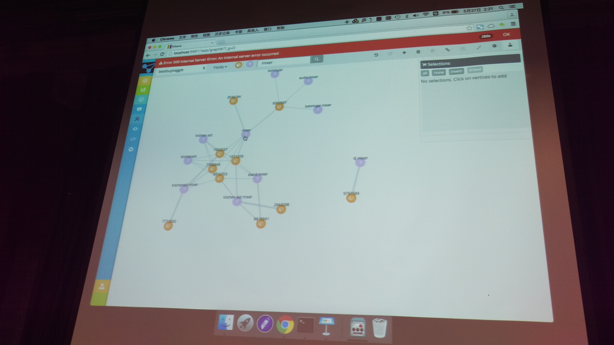
曾勇展示了Elastic 5.0的一個新功能，就是建立關聯分析圖，細節可能等使用過才知道。

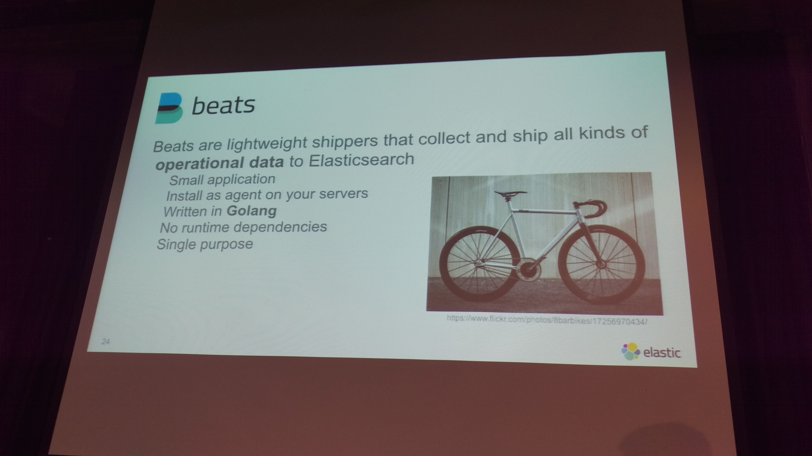
有花一些時間介紹Beats，也就是用來安裝在主機上蒐集資料傳送到Elastic Stack的小agent，以前都是用Logstash或者Logstash Forwarder，但是這樣環境就需要JAVA會有點肥大，所以他們開發了Beats，也就是適用於不同環境的輕量化資料代理轉發程式。

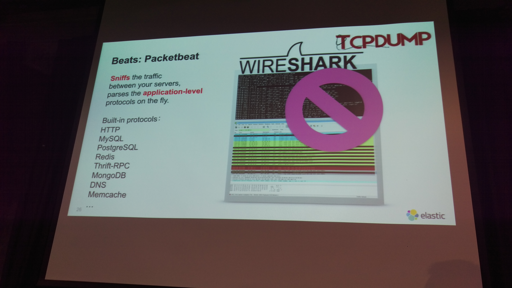
在beats之中有一個特別的產品叫做Packetbeat，直接安裝在伺服器上面，即時解析應用層的協定，目前支援的應用程式有：

* http
* MySQL
* PostgresSQL
* Redis
* Thrift-RPC
* MangoDB
* DNS
* Memcache
等，實用性相當高，在Elastic官方網站也有Live Demo，可以直接連過去參考 http://demo.elastic.co 。

Elastic Stack的告警機制，預先定義好規則，讓程式來通知你。也提到一條好萊塢守則　- Don't call us, we will call you!

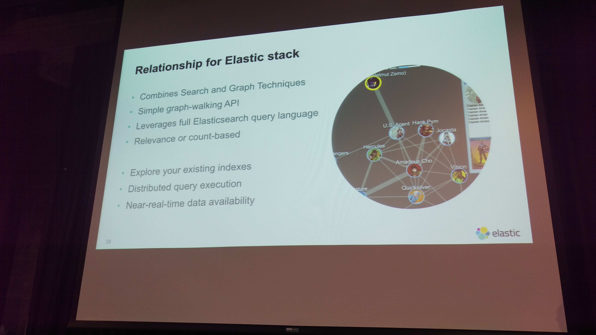
前面提到的新功能，Elastic Stack關聯繪圖，結合搜尋跟繪圖的技術，提供簡單的graph-walking API，讓使用者能夠透過完整的Elasticsearch搜尋建立關聯性圖形。

這類技巧跟方法可以用在關聯性辨別、詐騙偵測、商品推薦等。

####Get visibility form our application & user
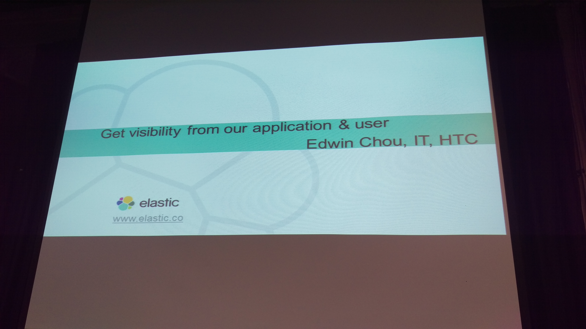
主講人：周鉦琪　HTC 資深副理

M9碰到主管可能比較正常，這是周副理。

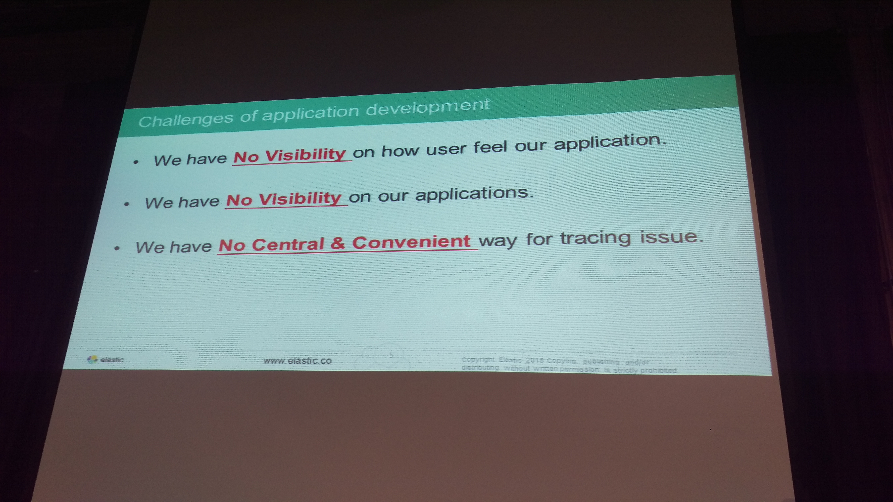
先點出軟體開發的挑戰，包含了：
1. 我們看不到使用者覺得這個應用如何
2. 我們看不到應用的深層細節
3. 缺乏一個集中、方便來追蹤議題的方法

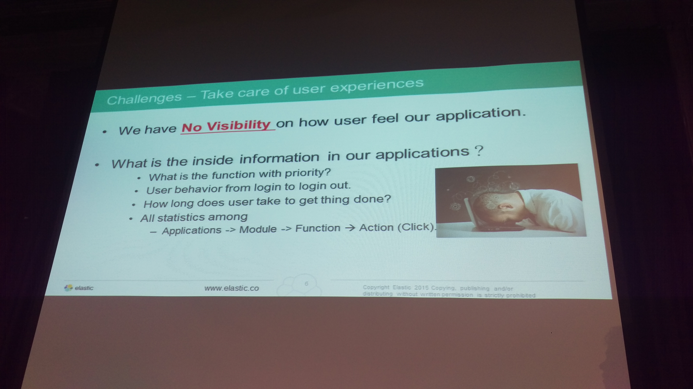
如何照顧好使用者經驗？因為我們平常無法得知使用者對我們的應用程式感覺如何。所以要想辦法從操作和行為上去挖掘內部的資訊。那麼，應用程式有什麼隱含的資訊呢？各項功能的重要性、優先程度如何？使用者從登入到登出的狀態，使用者花了多少時間才把事情做完？所有使用的歷程如何統計的。

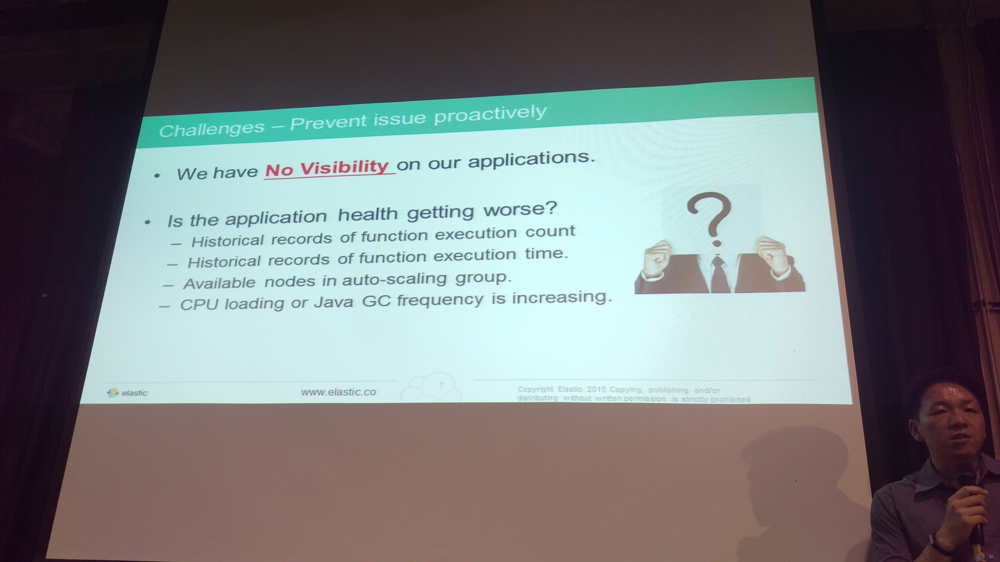
看得更精細，才有機會主動預防問題發生。怎麼知道應用程式的健康狀態有沒有變差呢？要知道功能執行總數、功能執行時間的歷史記錄，自動擴大規模的群組節點，CPU負載或Java GC頻率增加等等。

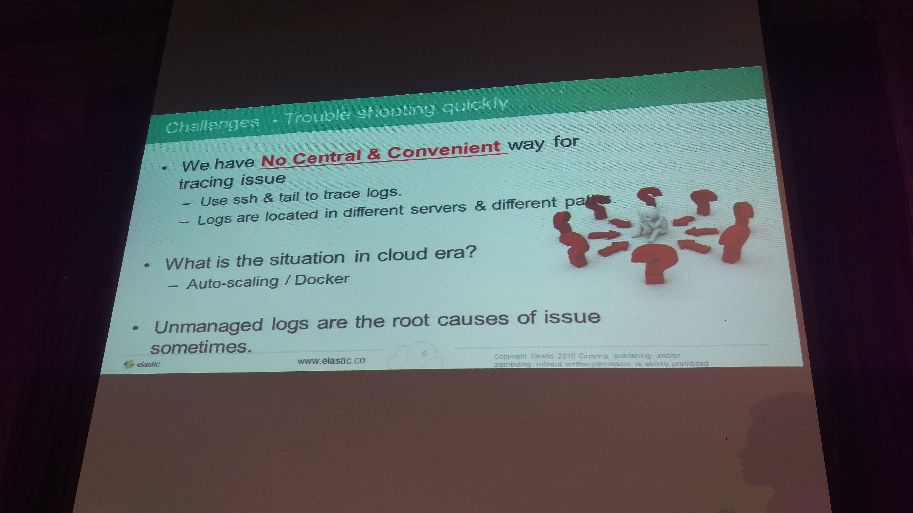
快速除錯的挑戰。由於以前缺乏一個集中、方便來追蹤議題的方法，我們必須要使用ssh一台一台登入，然後再慢慢使用tail去追蹤服務或伺服器的日誌，而日誌又散落在不同的伺服器和不同的分割區，管理起來或者遇到要除錯的時候，都會是很讓人困擾的問題。

在雲端時代呢？因為主機和服務會auto-scaling或者存放在docker，需要的時候才啟動才會跑，不需要的時候可能就關掉或回收，根本無從除錯，這些無法管理或不易管理的日誌，有時候就會是造成問題的根因，所以一定要有辦法才迎戰雲端新時代。

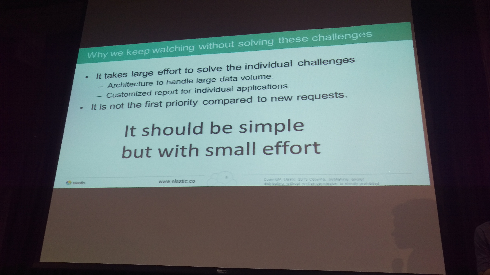
上述議題沒解決之前，為什麼要這麼辛苦地繼續監看呢？因為，需要花很大的努力才能解決上述三個議題，而要解決議題又需要一個可以處理這麼大資料量的架構，然後如何針對個別的應用程式產出客製化的報表，都是問題。而在一個企業或組織來說，解決上述問題的重要性和優先性，往往沒有處理使用者或老闆新的要求來得高。

所以，想要解決上述議題，最理想的方法就是可以簡單做到，然後不要花太多的力氣。（這當然，誰不希望這樣）

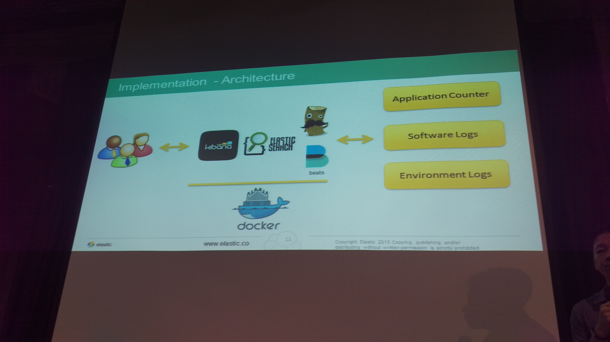
所以HTC也是透過Elastic Stack再加上docker的應用，來解決上述議題，並且用來收容應用程式記數(application counter)、軟體日誌(Software Logs)跟環境日誌(Environment Logs)。

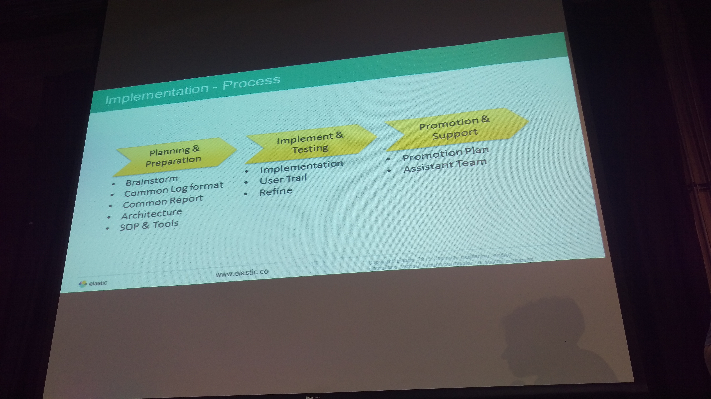
這是HTC的實做流程，大致是三個階段，參考圖就好。

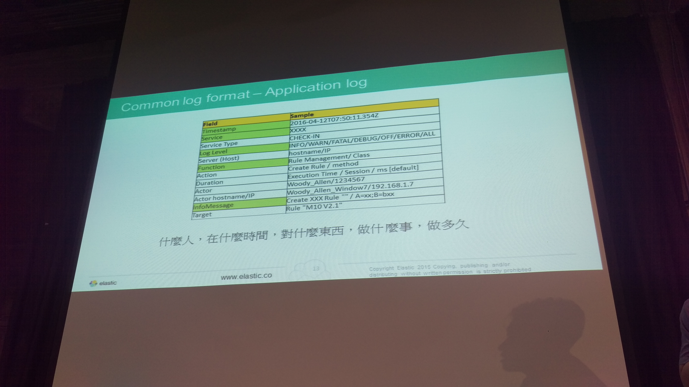
副理有提到，軟體日誌最重要的就是要能夠清楚知道：什麼人，在什麼時間，對什麼東西，做什麼事情，做了多久，把握這個原則，透過這些因素設計資料欄位(在Elasticsearch中就是Type要定義好)。

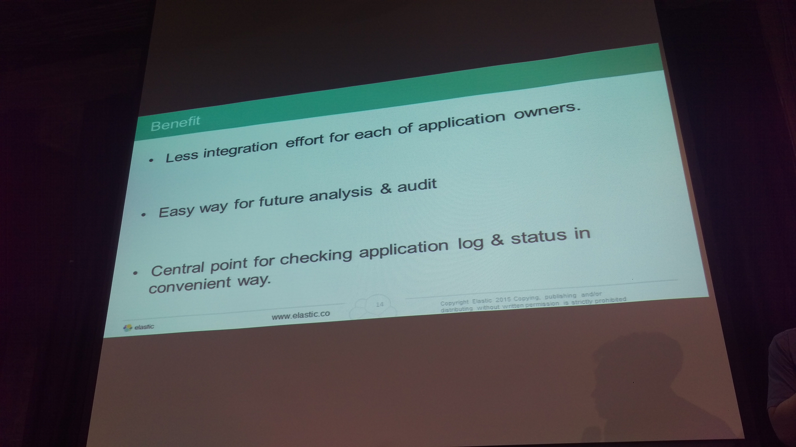
最後提到HTC導入Elastic Stack的好處，減少跟每個應用程式owner整合的功，因位都講好要看的東西是哪些了，也比較簡單能夠達到未來的分析和稽核，最重要的是，有個集中管理進入點，能夠很方便的檢查所有的應用程式日誌。

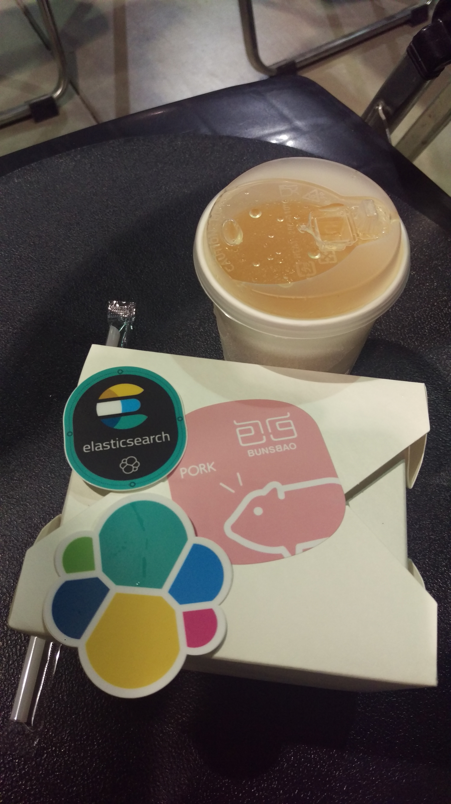
中場點心時間，今天先下班，後面三個議程待續。

####整合Hadoop及Elasticsearch，加速大數據應用。

主講人：陳進賢　歐立威技術協理

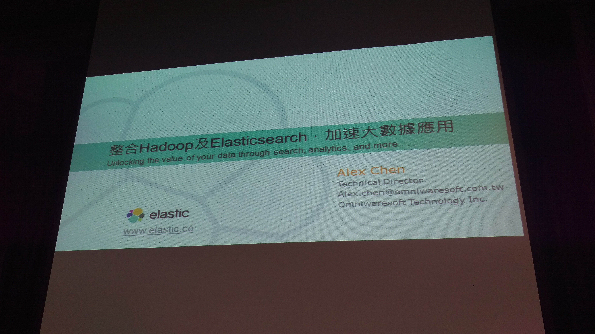

吃完點心以後，由Alex說明ES整合Hadoop的應用。在Elastic的產品線之中，有一塊是ES-Hadoop，也就是做為串連Elasticsearch跟Hadoop的中介專案。

先說明了新興的資料架構(Modern Data Architecture, MDA)以及Hadoop扮演的角色。

接著是提到Data Warehouse如何進行最佳化，