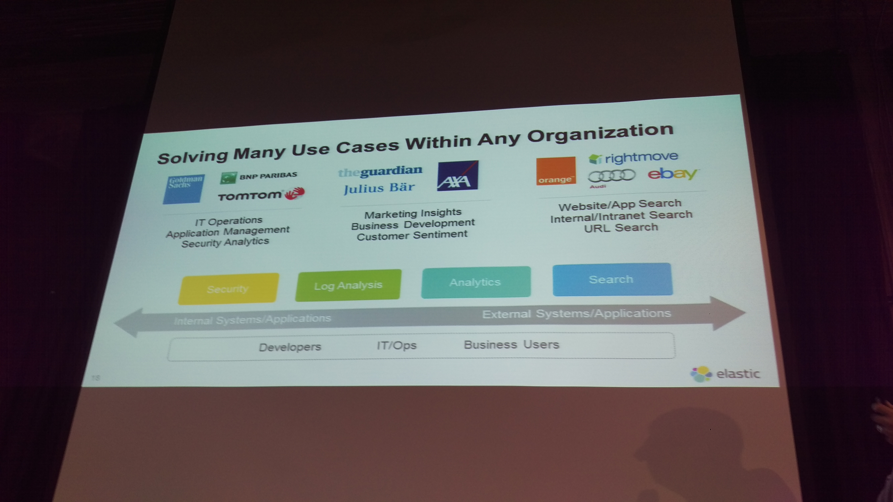

# Elastic Event

2016-05

##一、前言
Elasticsearch 為全世界最火熱即時搜索和分析資料引擎領導者
May 27, 2016　|　華山文創・台北

這麼強悍有霸氣的標語，能喊出來的應該沒幾個，而我相信Elastic真真切切有資格稱為即時搜尋和分析資料引擎的領導者。去年底因一些機緣，開啟了Elasticsearch、Logstash、Kibana的學習與使用過程，也開始關注ELK發展，上週某天忽然發現Elastic有場研討會在台北，速速點選報名，希望能有更伸更多的瞭解。

以下是些現場照片跟簡單的個人紀錄與心得分享，Elastic Stack能作的事情很多，繼續向前走，多學習多探索。

###二、議程摘要
以下是研討會議程，資料截自研討會官網：

####Elastic 市場策略及業務發展
主講人：何致偉　Elastic 亞太區銷售總監

####Elastic Stack + X-Pack
說明並窺視即將上市 Xpack，針對企業完整從日誌或檔案取得至分析呈現一鍵操作和管理，為企業創造最佳效率。

主講人：曾勇　Elastic 技術顧問

####HTC宏達電Use Case
HTC 宏達電將現身說法，分享行動裝置線上軟體更新、裝置管理、行為分析及研發生產自動化資訊架構與維運。

主講人：周鉦琪　HTC 資深副理

####整合Hadoop及Elasticsearch，加速大數據應用
大數據平台組件是很複雜且多元的，以 Hadoop 為 Data Lake 的中心，看看 ElasticStack 如何串接及應用。

主講人：陳進賢　歐立威技術協理

####ELK-統一資訊(PIC)日常系統維運的好幫手
統一資訊(PIC)如何運用 ELK於內部應用系統及對外營運系統的管理工作

主講人：劉祖弘　統一資訊平台技術 TEAM 工程師

####Log Analytics在金融與IOT的成功案例
分享銀行業如何利用 Log Analytics 成功收集銀行重要資訊，帶動銀行業務。以及在金融業機器如何藉由 Log Analytics 升級成高效智能的金融物聯網服務。

主講人：陳文裕　數位無限軟體總經理

###三、與會過程
只貼議程救太敷衍了，有很大部分是不同領域的專家，不同領域和專業的內容，不甚瞭解也無法全吸收，就盡量看有記得什麼，中間穿插一些照片，請大家簡單配合心得服用囉！

(p.s. 不是我手殘發抖就是hTC M9的拍照不行，該換支手機了)

####Elastic 市場策略及業務發展

2.jpg
亞太地區銷售總監何致偉介紹主要使用Elasticsearch的公司關鍵評語作為開場，用Elastic Stack架構的人其實很多，以下是ㄧ些知名企業使用的簡單評語，這些知名企業包含：

1. Facebook - 處理六千萬的搜尋
2. theguardian - 處理超過四千萬個文件
3. WikiPedia
4. verizon
5. TomTom
6. Mozilla
7. NASA
8. eBay
9. E\*TRADE
10. Tango

16.jpg
應用領域包含：安全、日誌分析、分析、搜尋

17.jpg
整個產品線以前大家俗稱為ELK，現在要正名為Elastic Stack囉！而除了開放原始碼的Kibana、Elasticsearch、Logstash、Beats之外，加強ELK Stack的X-Pack，也就是需要付費訂閱的外掛套件，包含了Security by Shield、Alerting by Watch、Monitoring by Marvel、Graph by [???]。除此之外，還有提供雲端服務，也就是Elastic Cloud，直接訂閱服務就不用自己架設備跟服務，就整套可以拿來用囉！

####Introduction to Elastic Stack and X-Pack

19.jpg
接著由Elastic亞太區技術顧問曾勇，

23.jpg
第一次來台灣，另外想說，M9拍照真的很糟糕XD