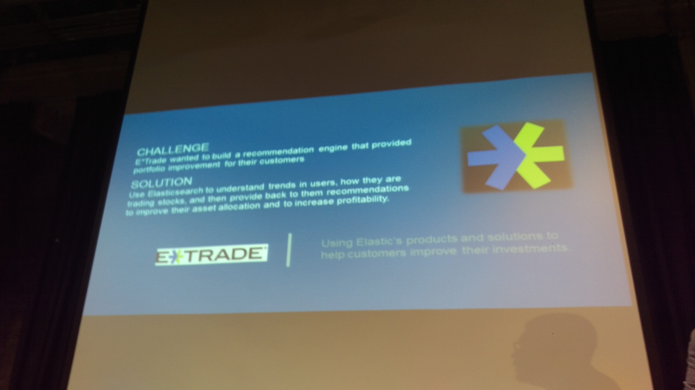

# Elastic Even# Elastic Event

2016-05

##一、前言
Elasticsearch 為全世界最火熱即時搜索和分析資料引擎領導者
May 27, 2016　|　華山文創・台北

這麼強悍有霸氣的標語，能喊出來的應該沒幾個，而我相信Elastic真真切切有資格稱為即時搜尋和分析資料引擎的領導者。去年底因一些機緣，開啟了Elasticsearch、Logstash、Kibana的學習與使用過程，也開始關注ELK發展，上週某天忽然發現Elastic有場研討會在台北，速速點選報名，希望能有更伸更多的瞭解。

以下是些現場照片跟簡單的個人紀錄與心得分享，Elastic Stack能作的事情很多，繼續向前走，多學習多探索。

###二、議程摘要
以下是研討會議程，資料截自研討會官網：

####Elastic 市場策略及業務發展
主講人：何致偉　Elastic 亞太區銷售總監

####Elastic Stack + X-Pack
說明並窺視即將上市 Xpack，針對企業完整從日誌或檔案取得至分析呈現一鍵操作和管理，為企業創造最佳效率。

主講人：曾勇　Elastic 技術顧問

####HTC宏達電Use Case
HTC 宏達電將現身說法，分享行動裝置線上軟體更新、裝置管理、行為分析及研發生產自動化資訊架構與維運。

主講人：周鉦琪　HTC 資深副理

####整合Hadoop及Elasticsearch，加速大數據應用
大數據平台組件是很複雜且多元的，以 Hadoop 為 Data Lake 的中心，看看 ElasticStack 如何串接及應用。

主講人：陳進賢　歐立威技術協理

####ELK-統一資訊(PIC)日常系統維運的好幫手
統一資訊(PIC)如何運用 ELK於內部應用系統及對外營運系統的管理工作

主講人：劉祖弘　統一資訊平台技術 TEAM 工程師

####Log Analytics在金融與IOT的成功案例
分享銀行業如何利用 Log Analytics 成功收集銀行重要資訊，帶動銀行業務。以及在金融業機器如何藉由 Log Analytics 升級成高效智能的金融物聯網服務。

主講人：陳文裕　數位無限軟體總經理

###三、與會過程
只貼議程太敷衍了，議程中有很大部分是不同領域的專家，有一塊主講Hadoop結合Elasticsearch的應用，不同領域和專業的內容，不甚瞭解也無法全吸收，盡量看有記得什麼，中間穿插照片，請大家簡單配合心得服用囉！

(p.s. 不是我手殘發抖就是hTC M9的拍照不行，該換支手機了)

####Elastic 市場策略及業務發展

亞太地區銷售總監何致偉介紹主要使用Elasticsearch的公司關鍵評語作為開場，用Elastic Stack架構的人其實很多，以下是ㄧ些知名企業使用的簡單評語，這些知名企業與短評如下：

1. Facebook - 一天處理超過6000萬個查詢，舉凡在Facebook的白色搜尋欄位中，找尋的項目都是透過Elasticsearch來進行的。

2. theguardian - 一天處理超過4000萬個文件，在全球的Web資訊進行即時分析。

3. WikiMedia - 提供靈活彈性的搜尋。

4. verizon - 即時日誌與分析索引超過5兆筆記錄，用來完成極重要的應用。

5. TomTom - 有了Elastic Stack之後，Tomtom能夠處理監控每秒超過6500的訊息，獲得更深層維運訊息，來調整分散在全球的應用、網站跟伺服器。

6. Mozilla - 每天使用ELK即時索引、搜尋、分析超過3億筆事件，保護網路、服務、和系統免於安全威脅。

7. NASA - 有跟火星的設備在通訊，延遲30分鐘的即時分析(因為傳回來就要30分鐘)，用在最佳化太空任務。

8. eBay - 透過Elasticsearch的幫忙，在全球的14個事業體服務2.5億位不同的使用者，購買5千萬個商品，處理每秒產生的15萬個查詢。

9. E\*TRADE - 使用Elastic產品和解決方案，幫助消費者改善投資。(照片糊了，請見諒)

10. Tango - 透過ELK即時監控日誌與管理效能，確保全球的2.5億使用者有良好的通訊品質。

總結以上，整體Elastic Stack的應用領域包含：安全、日誌分析、分析、搜尋等不同領域。

整個產品線以前大家俗稱為ELK，現在要正名為Elastic Stack囉！而除了開放原始碼的Kibana、Elasticsearch、Logstash、Beats之外，加強ELK Stack的X-Pack，也就是需要付費訂閱的外掛套件，包含了Security by Shield、Alerting by Watch、Monitoring by Marvel、Graph by [???]。除此之外，還有提供雲端服務，也就是Elastic Cloud，直接訂閱服務就不用自己架設備跟服務，就整套可以拿來用囉！

####Introduction to Elastic Stack and X-Pack

第一個議程接著由Elastic亞太區技術顧問曾勇(Medcl)主講，介紹整個Elastic Stack和X-Pack，照片裡還是亞太地區銷售總監何致偉。

曾顧問提到是第一次來台灣，另外想說，M9拍照真的很糟糕XD

非常活躍的開發者，先前在資策會參與Elasticsearch的課程，就有發覺到Elasticsearch RTF，原來作者就是曾勇！有興趣的朋友可以到曾勇的Github看看 http://github.com/medcl

我不是故意拍成這樣的，我沒有要牽拖是手機的問題...

先介紹ELK各個產品的Logo與變革。

還有以前常常讓人疑惑的ELK到底版本之間要怎麼搭配，因為不同的Elasticsearch、Logstash、Kibana是有相依性問題，不能隨意混搭的。

以前有一張Release Bonanza表格，可以看到該如何搭配。

Elastic公司自己也知道這問題，所以他們到了5.0版本以後，就統一版本號。