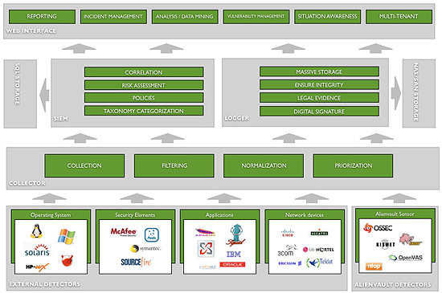
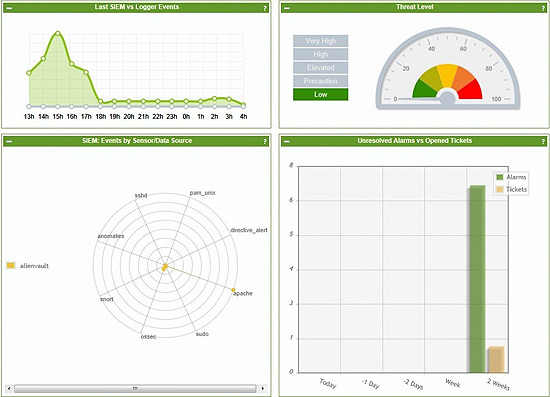
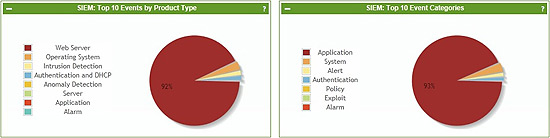
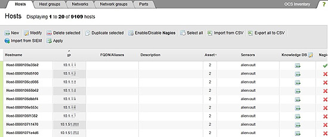
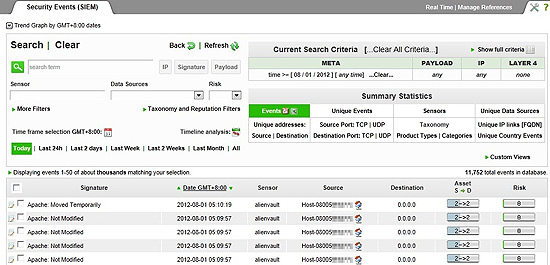
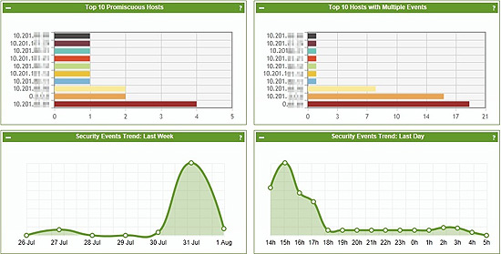
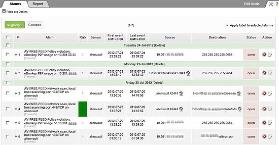
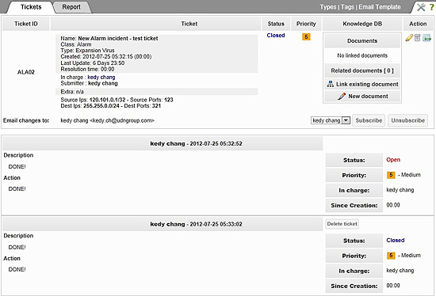

# 淺談資安訊息與事件管理與OSSIM

2012/08

##前言

在網際網路以及各式服務日益發達的同時，同時也帶來了資訊安全相當的風險與威脅，對任何企業來說，享受資訊網路的便利，也要同時減少導入便利的資訊服務帶來的風險，於是各式網路資訊安全設備應運而生，例如：防火牆（Firewall）、入侵偵測系統（Intrusiton Detection System）、入侵防禦系統（Intrusion Prevsion System）、網路流量過濾系統（Network Traffic Filtering System）等。然而，此類設備透過分析流進流出之網路流量特性與規則，從最基本的網路位址（IP Address）、連接埠（Port）分析，到進階的深度封包檢測（Deep Packet Inspection）以及網路行為模式分析（Network Behavior Analysis）等，無一不是希望能夠把異常或惡意的網路流量阻擋在企業外部，然而，資安防護技術與惡意入侵技術兩者是道魔關係，一尺一丈相互抗衡，現今更有許多透過隨身碟傳遞的惡意程式、伺服器或作業系統漏洞未修補的零時差攻擊（ Zero Day Attack ） 以及成長速度極快的殭屍網路（Zombie Network， Botnet），讓以規則與特徵為主的資訊安全設備防不勝防，可能在作業系統或者應用程式廠商尚未發布更新或者資訊安全設備廠商的特徵檔案尚未更新時，威脅已經悄悄的入侵企業內部，等待發病或攻擊的時機。

##安全事件資訊管理

以數位鑑識和電腦稽核的角度來看，日誌紀錄往往在服務瀕臨異常階段時能夠透露出蛛絲馬跡，因此，主動追蹤與分析重要網路設備、伺服器主機、作業系統、應用程式之日誌遂成一重要工作，而日誌與事件的數量，往往相當繁多，絕非一兩眼就可以找到事件重點，而是要針對一連串的事件進行關聯分析，進而分析出可能的威脅和找出事件發展的脈絡。對於有規模的企業來說，比較完善的方案為進行安全資訊與事件管理（Security Information and Events Management， SIEM），藉由完整的SIEM制度密切掌握重要服務的日誌現況，而不是單純的把日誌集中到某一台主機，然後沒有進一步對內容做分析和處理。企業之所以導入安全資訊與事件管理，最重要的是構築良好的安全資訊與事件管理機制，以便達到兩個主要目標：

1. 法規遵循 – 對應安全資訊管理，產出法規遵循報告，例如：ISO27001（資訊安全管理系統）、PCI DSS（支付卡行業資料安全標準）。
1. 威脅管理 – 即時監控程式或主機行為、應用程式相關活動，進而達到事故管理。

###一、安全資訊管理運作程序

為了達到完善的安全資訊與事件管理，整個SIEM基本運作程序如下：

1. 蒐集外部應用程式與外部裝置產生的事件資料。
1. 依照SIEM提供的要求/格式/規範產生事件日誌。
1. 蒐集與正規化事件後集中至SIEM主機。
1. SIEM主機分析日誌進行事件風險評估，並收納至資料庫。
1. 將資料庫中的事件進行數位簽章，再儲存至儲存空間。
1. 以公開介面（通常是網頁介面）提供報表系統、報告、監控介面、開單系統、弱點分析等功能，供管理人員或維運人員進行即時維護監看，掌握企業安全資訊與事件管理。

###二、安全資料管理特色

因此，一個完整安全資訊管理主要包含了以下特色：

1. 風險管理 – 通報管理者可能造成威脅的事件，評估超過一定風險指數後則需優先處理。
1. 風險關聯 – 將事件與事件間進行關聯性分析，例如：對於主機的暴力密碼破解，來自於一定數量嘗試登入失敗。
1. 風險矩陣 – 定義事件類別之風險係數以及依照設備服務之重要性給予資產價值，以利SIEM評估風險指數。
1. 弱點掃描 – 主動定期對重要資產設備進行弱點掃描並產出弱點報表，及早發現未修補可能造成企業資訊服務威脅之弱點。
1. 事件探勘 – 從大量事件抽絲撥繭，進行事件資料探勘，以進行特定事件數位證據的呈現與分析。
1. 即時監控 – 彙整安全資訊管理系統現況，以整合監控面板（Dachboard）即時顯示各項設備安全資訊與事件狀況。

##先行研究

2012年10月1日預定新版個資法（包含施行細則）正式施行上路，新法要求資訊系統存取的軌跡資料需妥善保存，各企業對於安全資訊事件管理建置有實質的需求，技術發展組有鑑於此，開始投入 SIEM 系統的研究與測試，商業版部分有GFi Enents Mamager，開放原始碼專案有AlienVault OSSIM， the Open Source SIEM，技術發展組與資安組先針對可能之解決方案進行研究並建置測試環境，配合報系推廣開放原始碼專案軟體之精神，研究初期選定由AlienVault所開發的開放原始碼安全資訊導入系統 – OSSIM， the Open Source SIEM，OSSIM已經發展相當長的歷史並同時有商業版，目前導入範圍為技術發展組使用電腦以及組內服務主機，觀察搜集日誌狀態。

###一、OSSIM架構分析

OSSIM整體為一開放原始碼架構之安全資訊管理系統，其中又大量使用其它開放原始碼專案內容，相關技術套件功能與對應之專案分析如下：

* OpenVas – 開放原始碼專案之弱點檢測與掃描系統，用來對管轄的資產進行弱點掃描與弱點分析，蒐集大量弱點資料以進行掃描。
* Snort – 開放原始碼之入侵偵測系統，用來分析網路流量之封包行為，與特徵檔案比對，找出對於伺服器或網路設備異常的入侵或攻擊。
* NMap – 對企業內部網路資產進行掃描，快速得知企業網路上所有伺服器與連網電腦主機及其開放的連接埠、服務等，有效得知服務是否有不正常開啟的情況出現。
* Nagios – 用以偵測監控網路資產之服務以及主機存活狀況，以快速得知服務以及主機是否正常運作。
* Apache – 提供OSSIM網頁管理介面，讓維運人員使用網路瀏覽器即可得知整個企業內SIEM狀態。
* PHP – Hypertext Preprocessor，配合Apache使用之網頁直譯程式語言，提供網頁程式設計功能，加強使用者與系統間之互動性，在OSSIM中主要負責主機資源調配或者後端程式呼叫與控制等。
* MySQL – 開放原始碼之資料庫，在OSSIM中主要用以儲存企業網路資訊資產狀態、安全事件分析、日誌記錄儲存、報表產出與法規依循性報表架構等。
* Ajax – 提升管理者使用網頁管理介面之互動型與即時性，透過Ajax技術讓OSSIM網頁管理介面更人性化。

###二、OSSIM執行內容

建置完成以後，加入部分監控對象，再讓OSSIM執行一段期間進行日誌與事件資料蒐集，在監控面板可以看到整個安全資訊日誌管理環境的統計狀況，包含最近的安全資訊與事件與日誌數量（Last SIEM vs Logger Events）、威脅等級（Threat Level）、安全資訊事件管理資料來源（SIEM: Events by Sensors/Data Source）與未處理告警及開單數（Unsolved Alarms vs Opened Tickets），畫面配置清楚整體項目亦一目瞭然。

監控面板也提供了主要事件來源，包含十大安全資訊事件來源類別（SIEM: Top 10 Events by Product Type）與十大資訊分類（SIEM: Top 10 Event Categories），讓管理與維運人員能夠透過此一畫面快速得知可能造成威脅的來源以及事件類別為何。

報系機房以及行政區域均有相當多的電腦上線，要完成整個報系資訊資產分系不是一件簡單的事情，透過OSSIM能夠初步透過NMap對報系內部網路分析，找出所有在網路上的資訊資產，然而，執行整個報系內部網路掃描勢必耗費不小的網路資源，為避免影響同仁日常作業與繁忙的報系業務執行，技發組本次僅針對小範圍區段IP進行掃描，驗證網路資產掃描分析之正確性。

蒐集一定數量與程度的事件與日誌之後，OSSIM會一邊針對事件內容進行關聯性分析，進而產出SIEM安全事件，此介面可以清楚得知事件主要發生節點、時間、發現裝置（Sensor），並顯示出該事件的風險值，讓維運人員能夠依照風險高低處理事件。

OSSIM亦提供了安全事件來源資產（受管理的資訊資產設備）事件量化排名，如單一主機出現大量事件，則很可能表示該主機之狀態異常，必須優先觀察處理該狀況，避免造成預期外的損失。

在告警部分，則是安全資訊事件進行關聯分析以後，產出的警告訊息，每一個訊息都會寫明告警原因、發現裝置、告警來源、告警目的與時間等，在OSSIM中亦提供了類似報系Service Desktop服務（eSD）的開單系統，每個告警事件均會開單，並自動指派由負責的維運人員處理，此面板可以同時看到各告警的處理狀況。

前述提及之類似eSD的開單系統，畫面如下圖所示，可以針對各告警指定給不同權限與等級之人員處理，每張事件單（Ticket）都會詳細記錄日期、時間、處理狀況以及處理人員。如果公司的eSD系統能夠跟此開單系統整合，或許能夠讓同仁們更快上手此安全資訊管理系統-OSSIM。

##結語

在科技日漸進步以及各項資訊服務日益發達的同時，報系也必須針對可能影響日常業務運行的風險提早做好因應，導入完整的安全資訊與事件管理程序就是一項重要的工作，透過SIEM導入，對重要的主機與服務設備進行流量以及日誌分析關聯，即時分析、盡早發現異常狀況。後續技發組將持續評估導入安全資訊與事件管理程序的其他方案，試著找出對同仁與報系最有幫助的機制與程序，讓同仁能夠安心無虞的使用各項資訊系統與服務，提高報系資訊安全環境與生產效率，降低因資安事故而影響內容生產的機率。

##備註：

* 深度封包檢測（Deep Packet Inspection）：針對網路流量，執行即時分析和觀察，能夠判斷來源主要為何種應用程式。
* 零時差攻擊（ Zero Day Attack ）：在廠商（官方）尚未發現弱點或者尚未針對弱點進行更新修補（patch）時，即被惡意駭客或攻擊者使用該漏洞，系統維運商或使用者完全無法防範或發現該情況，因此被稱為零時差攻擊。
* 殭屍網路（Zombie Network， Botnet）：一種新興的網路攻擊型態，攻擊者透過惡意程式放到使用者端，等到大量蒐集控制的使用者端以後，透過命令與控制中心（Command and Control， C&C）對被控制的使用者下達指令，可同時動用大量網路上的電腦對企業網站或服務進行攻擊，因中了惡意程式的使用者毫不知情，就像殭屍或魁儡一樣被操控，因而得名殭屍網路。
