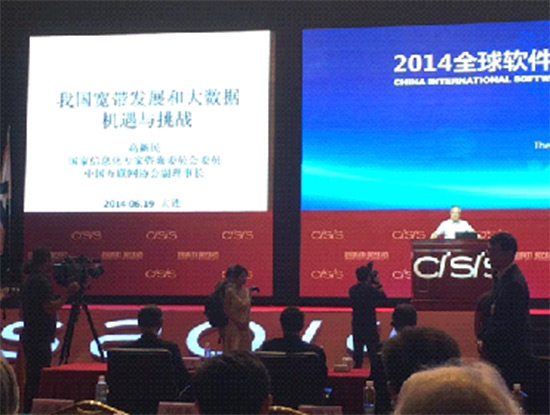
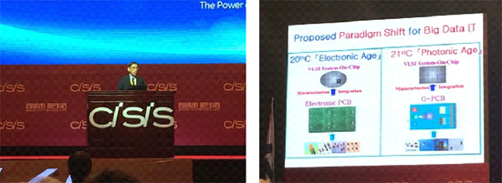
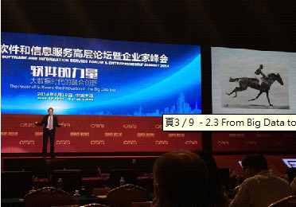
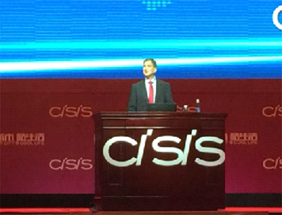
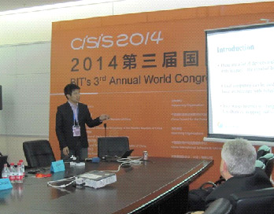
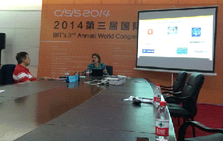
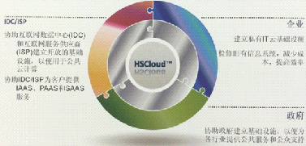

#世界雲端大會紀實 Big Data篇

2014-06

##一、會議簡介

BIT’s 3rd  Annual World Congress of Cloud Computing 2014 (2014世界雲端大會)本研討會已舉行至第三屆，由中國國際軟體與資訊服務高峰會(China International Software & Information Service Fair, CISIS 2014)為基礎，展開四大類主題研討會：分別為CloudCon, InfoTech, U-World, Cultural & Creative IT，聯經數位技術發展組研究員張凱迪受邀參加CloudCon 2014，屬於CISIS下之分支，探討雲端運算領域之技術與應用，CloudCon和InfoTech為CISIS分支中，前端技術議程(Frontier Technological Program)為全英文議程之研討會。

會議於大連世界會覽中心舉行，位於中國遼寧省大連市星海廣場旁，今年CISIS2014大會精神標語為：Smart City & Cool Life，代表「智城市、酷生活」，希望將中國大連打造成「智慧城市」，透過雲端服務及物聯網技術，結合Big Data發展各式各樣的應用，為人民帶來「玩酷生活」，其發展方向與報系近兩年努力的物聯網應用、智慧連網應用非常契合，顯見也是整體資通訊產業努力發展的方向。

##二、Keynote Speech

###2.1中國大陸在寬頻網路和大數據的機會和挑戰

####高新民／中國互連網協會副理事長

主講者首先提到，未來趨勢為Software define anything & everything connected，美國有10年寬頻國家計畫，中國早期很多地方著重在傳統基礎建設(鐵、公路)發展，鑒於網路的速度將是未來另一種形式的國力展現，中國從2013便開始加強寬頻網路策略，目標大量提升速度、普及率和創造更多應用，2014年中國網路使用人口約2億人，但換算成普及率只有14%，仍相對偏低，而且在SpeedTest排名平均用戶使用網路速度排名43，顯示仍有很大的進步空間。近年來中國積極發展電信核心業務與下一代行動通訊，也就是最近剛在大連啟動的移動4G和LTE，背後大量使用中國製造的電信設備，並且大幅部署公共區域Wi-Fi，結合行動網路發展，藉由大量人口使用網路，抓住電信核心業務的機會和經驗，增強中國行動寬頻網路實力。

在資料(Data)部分，未來會跟土地還有水一樣重要，凱迪認為，不同的是地方是土地跟水都是有限的資源，資料卻會源源不絕增加，要有一定的技術手段蒐集和分析資料，才能把這些資料產生價值，否則資料只是一堆的0和1而已。也就是說，當資料產生價值成為資訊(Information)的時候，這些0和1就能夠轉為資源和財富。

未來中國將積極準備資料的開放、共享以及建立交易的機制(類似Open Data，並建立商業模式)，因為資料多少涉及商業機密和國家機密，也會有法治和隱私的問題，所以整套共享和資料交易的機制，尚待中國官方努力中。

###2.2 Optics for Big Data Information Technology in 21st Century

####Prof. El-Hang Lee／IHNA University Distinguished Professor

(右圖:光電路板取代傳統電子PCB電路板)

Prof. Lee從光學的角度看大數據的應用，先回顧20世紀到21世紀的資訊科技發展，再講到乘載數據的介質，以前是銅纜雙絞線的天下，未來光的傳遞和用光纖取代銅纜線路則有可能成為趨勢，甚至「電路」板都會變成「光路」板。

2.3 From Big Data to Big Business: How Big Data is Transforming Business and the Economy
Prof. Viktor Mayer-Schonberger 
Professor of Internet Governance and Regulation at Oxford Internet Institute.

演講風格非常類似蘋果電腦的Steve Jobs、來自牛津大學網路研究所的Prof. Viktor Mayer-Schonberger說明Big Data、IOT對經濟和商業領域造成的改變和影響，也就是未來Big Data形成資料與經濟的生態系統。

一開始提到，Big Data的時代大家都蒐集大量的資料，接著舉例，資料的品質很重要，品質足夠就可以從把東西從照片變成電影。再說明，怎麼挑選重要的「資料」，例如：第一張照片重點在牙刷，第二張照片重點在小孩，以前的相機只能挑一個焦點（資料重點），但是未來可以「全部蒐集」，等到要看的時候再切換重點，這也會讓資料蒐集量大增，是一種不同形式的Big Data。

同一場景中，以不同對焦點所拍攝出來的照片
Amazon用不同的user profile來推產品，也就是透過使用者資料進行商品推薦，跟報系的分眾行銷概念雷同，以前這種應用稱不上Big Data，只能算是Small Data，從小部分資料進行運算推薦，但是當使用者很多，購買記錄很多，有能力進一步把這些資料相互關聯、交叉分析並累積資料的時候，就變成Big data的事情了，Amazon因為這件事情做得很好，增加了30%的收益。

空中巴士A380每次飛行都會產生3GB的資料，Rolls-Royal用這些資料來預測一臺飛機的飛行狀況，例如：評估目前的飛行狀態中，飛機是否安全？飛行過成中，哪些地方可能有問題？這些預測的工作需要透過大量資料累積、分析以後才能完成。

最後提及，市場一直在變，未來沒有永遠的朋友也沒有永遠的敵人，例如：Google跨入自動車的生產製造，變成各大車廠的競爭者，但是對Google來說卻是開創了新的市場。由此可見，Big Data帶來新的機會，也創造新的競爭者，因此，如何把資料的價值找出來，會決定是不是能成為一個New Business的關鍵，所有組織想要進步，就是要在這些資料裡面挖礦，找出價值、賦予價值。

###2.4 Surround computing: the next era of innovation
####Mark Papermaster／Senior Vice President and Chief Technology Officer, AMD

Surround computing概念為：運算裝置和資料中心將蒐集更多資料，觀察更多你的行為，推測你將要去的地方，幫你做出你想要的事情。身邊所有事物都會有運算的成分在其中。

該怎麼感受Surround computing的威力呢？Mark舉例，通常在運算的領域看事情，都要經過一個小「視窗」，也就是現有的環境被「視窗」框限住了。(Mark暗諷微軟。)

但是來到surround computing的世界，將會看到全新不同的感受。從你的喜好，你的經驗，經過大量裝置的運算估算，自動幫你處理你下一個行程，你想吃飯的地方，你的交通，你的行動，你的支付，只要有你的smart client和surround computing就幫你完成。

初期看，Surround computing像什麼呢？從視覺面來看，驅動更多pixel、顯示更多pixel，提供Eye-definition visual realism達到近乎真實的視覺體驗。

聲音部分，透過Surround computing進行3D的聲音音效和語音串流，達到真實世界聲音，目前AMD號稱可以做到32聲道運算。

因此，要完成這麼多的事情，核心平台會是一個smart cloud，才能夠把這些眾多的裝置連在一起，並且對這麼大量的裝置下指令去處理，而為了接受smart cloud的指令，就需要了smart client，也要即時、natural human communication，包含顯示聲音和大量近乎人類的運算，要達到理想的surround computing，還要再加上智慧推算，行程估計，與金流消費等的多方整合。

為了達到smart cloud大量運算需求，AMD發展APU-accelerated processing unit，整合了繪圖單元處理平行workloads，以及中央處理單元處理序列workloads。同時，也採用大量的open source以及開放標準，減低技術界接門檻，增加開發上的彈性，此點理念與Intel相同。

目前潛在使用範例：可應用在娛樂，透過各式各樣的運算技術，把聲光效果做到最完整的呈現。以及smart city，包含可以跟人互動、客製顯示的kiosk，達到更多的預期零售體驗，以及大資料視覺化等。

##三、與會過程

會議的Sector 2為CloudCon2014之Frontier Technological Program，邀請雲端運算各領域學者專家齊聚一堂，CloudCon主題為：Chinese Dream in Cloud，依專業領域不同，共分六個子議程：

Cloud 2-1: Global Cloud Computing Economy-Strategy to Business
Cloud 2-3: Cloud Security and Privacy
Cloud 2-5: Cloud Solutions & Energy Efficiency
Cloud 2-2: Cloud Architectures and Applications
Cloud 2-4: Big Data & New Services in Cloud
Cloud 2-6: Global Cloud Computing Adoption

###3.1 報告簡介

研究員張凱迪於大會Cloud 2-4: Big Data & New Services in Cloud議程發表演講 - The Potential Cloud Business Model of Internet of Things - Case Study of Shopping Malls，以聯經數位事業發展部執行物聯網(IOT)專案之成果做案例分享，包含：

1. 以兩期信義商圈智慧聯網為案例，分享結合物聯網應用對百貨業型態轉變。
1. 透過計畫執行，讓業主應用行動載具與物聯網技術於場域中，開啟物聯網時代嶄新商業模式。
1. 透過雲端運算技術，滿足未來場域快速複製與使用者增量下服務穩定度與彈性，將是持續研究課題。

本公司張凱迪發表IoT專案的案例分享

###3.2 Cloud, Big Data and the “Next Big Thing”
Ms. Jacqueline Vanacek／Vice President, Cloud Evangelist and U.S. Cloud commissioner, SAP, USA

本主題由 Ms. Jacqueline Vanacek分享，她說紐約是一個Big data的好範例，在雲端有很多的資源資金投入，也指出「mobile is cloud in your pocket」，可見行動裝置和雲端的密切度，並提及個前端趨勢有：smart phone, data-driven health care, the last second economy, credit card are new platform，也強調每件事物都連網，跟mobile cloud結合，並且IOT變成smart transportation。除了mobile device外，各種穿戴式裝置與應用將開始普及，尤其是用在醫療(healthcare)方面的設備，未來的Big data應用有很大一塊會在「個人化醫療」出現，隨時隨地詳實記載生理健康訊號的每一部分，並且有大量的資料後端進行分析比對。

##四、參觀展覽

###4.1 Pactera-文斯海輝

文斯海輝是非常大的雲端服務供應商，顧問商以及SI。

####4.1.1 雲端服務產品

IaaS
SaaS
HSCloud
雲OSS/BSS
測試雲
IT服務雲
4.1.2 服務流程外包

業務包含技術支援、數據操作、事務處理、知識流程外包、客戶服務與呼叫中心等，著重以下市場：

銀行與金融
旅遊與運輸
出版與檔案

####4.1.3商業智能分析

預測分析產品(客戶關係管理、財務績效管理、操作生產)
BI解決方案(CRM、風險管理、財務風險、營運管理、企業應用服務)
底層有Hadoop框架，支撐大量數據和服務。採用常見的技術：Perl、Shell script, Java, Informatica, Control-M, Hive, Hadoop, DB2, Python, Diango, Mako, Jquery

####4.1.4企業行動解決方案

類似中華電信企業簡訊和SNS簡訊特碼，提供簡訊的應用：

行動SNS解決方案(聯絡人、企業社群、企業通訊、企業倉庫、企業辦公、應用SNS)
民航行動應用平台(飛行、乘務 、面客服、機務、貨運)

####4.1.5社會化營銷管理系統

透過社會化網路(微博)進行數據探勘蒐集並加強CRM，尋找和搜集客戶、開發市場、營銷產品、客服產品銷售等形成管理系統，目標是低成本找到高潛力客戶。

挖掘和高效率精準分眾，最大化企業營銷成果。

##五、結語

從本次研討會，歸納以下結語：

1. 資通訊產業發展積極往雲端運算、物聯網、Big Data領域邁進，此已是明顯趨勢，會需要搭著良好的基礎建設(有線、無線)進行，重點發展也需要政府與大型企業投入相對應資源。
1. 開放原始碼(Open Source)及開放標準(Open Standard)被多家大型公司採用，未來新服務與應用將以開放架構為基礎，並會是比誰佈署速度快的時代。
1. 資訊安全議題絕對是現有商業服務能否快速邁向雲端的優先考量，未來資管處與聯經數位均有符合CSA STAR導入顧問資格的同仁，能以雲端安全聯盟的標準，評估雲端服務及供應商的安全成熟度。
1. 資料的價值待擁有者挖掘發現，加值後的資料亦將是開創新事業的關鍵。

非常感謝公司提供此機會，讓筆者能到中國大連參加CloudCon2014研討會，一方面介紹聯經數位在智慧商圈專案執行成果，同時能跟多國專家交流心得，更看到中國大陸很有企圖心地展開下一個世代的市場與戰場，相信對我們來說，絕對是一個機會也是一個挑戰。