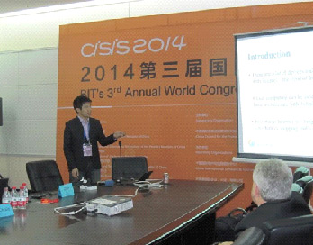
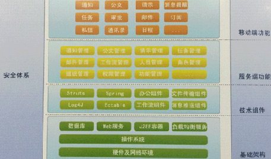

#2014世界雲端大會紀實 - Cloud Computing 篇

2014-06

##一、會議簡介!
BIT’s 3rd  Annual World Congress of Cloud Computing 2014 (2014世界雲端大會)本研討會已舉行至第三屆，由中國國際軟體與資訊服務高峰會(China International Software & Information Service Fair, CISIS 2014)為基礎，展開四大類主題研討會：分別為CloudCon, InfoTech, U-World, Cultural & Creative IT，聯經數位技術發展組研究員張凱迪受邀參加CloudCon 2014，屬於CISIS下之分支，探討雲端運算領域之技術與應用，CloudCon和InfoTech為CISIS分支中，前端技術議程(Frontier Technological Program)為全英文議程之研討會。

會議於大連世界會覽中心舉行，位於中國遼寧省大連市星海廣場旁，今年CISIS2014大會精神標語為：Smart City & Cool Life，代表「智城市、酷生活」，希望將中國大連打造成「智慧城市」，透過雲端服務及物聯網技術，結合Big Data發展各式各樣的應用，為人民帶來「玩酷生活」，其發展方向與報系近兩年努力的物聯網應用、智慧連網應用非常契合，顯見也是整體資通訊產業努力發展的方向。

##二、Keynote Speech
###2.1 華為智慧城市解決方案，現代城市智慧化助推器
####胡善勇/華為企業業務中國區總工, 中國信息安全學會常委

一開始從減肥的觀點切入演講，人與人之間的六分割理論，已經縮短為4.7分割，再轉化思考的觀點，也就是一個變胖，間接會影響4.7個人變胖，這是社會問題。從這個例子說明，以後思考問題的時候，要從網路和社會的思維出發。

華為認為未來城市是三層架構

在華為的看法，未來城市會是三層架構，最底層是城市網路，中間是城市資料中心，上面則是開放雲平臺，提供各式各樣的服務。

智慧化是問題的解決方案，華為提供軟體和硬體，並認為長期演進技術(Long Term Evolution, LTE)將是完成智慧城市版圖的最後一哩(Last mile)。未來的資料中心在基礎建設的物理概念是分散，但管理邏輯上是統一的。最終提及，要達到智慧城市有三個階段，分別是建設、維運、服務，未來「維運」將持續被優化，變成零人力，一切都透過雲端完成，人力將只投注在「建設」和「服務」之上，讓人脫離煩瑣的工作，可以投入人力在創造更多的價值。

##三、與會過程

會議的Sector 2為CloudCon2014之Frontier Technological Program，邀請雲端運算各領域學者專家齊聚一堂，CloudCon主題為：Chinese Dream in Cloud，依專業領域不同，共分六個子議程：

* Cloud 2-1: Global Cloud Computing Economy-Strategy to Business
* Cloud 2-2: Cloud Architectures and Applications
* Cloud 2-3: Cloud Security and Privacy
* Cloud 2-4: Big Data & New Services in Cloud
* Cloud 2-5: Cloud Solutions & Energy Efficiency
* Cloud 2-6: Global Cloud Computing Adoption

###3.1 報告簡介

研究員張凱迪於大會Cloud 2-4: Big Data & New Services in Cloud議程發表演講 - The Potential Cloud Business Model of Internet of Things - Case Study of Shopping Malls，以聯經數位事業發展部執行物聯網(IOT)專案之成果做案例分享，包含：

1. 以兩期信義商圈智慧聯網為案例，分享結合物聯網應用對百貨業型態轉變。
1. 透過計畫執行，讓業主應用行動載具與物聯網技術於場域中，開啟物聯網時代嶄新商業模式。
1. 透過雲端運算技術，滿足未來場域快速複製與使用者增量下服務穩定度與彈性，將是持續研究課題。

本公司張凱迪發表IoT專案的案例分享

###3.2 Accenture Internal IT: Cloud Power the Digital Agenda
####Dr. Ken Corless/Managing Director, Accenture, USA

Dr. Ken Corless分享Accenture Internal IT: Cloud Power the Digital Agenda，說明雲端運算技術如何推動傳統服務的改變，並舉數位商務(Digital Business)為例：從傳統的DVD到現在的網路串流服務(Netflix)，還有蘋果電腦(Apple)如何改變音樂工業的生態，甚至有一些服務商都採雲端服務，包含了採用微軟的Office365作為文書軟體解決方案，Salesforce採雲端顧客關係管理(CRM)以及Yammer提供了類似Facebook環境的辦公平台，這些改變都告訴人們，不要跟趨勢作對，否則受傷的會是自己，並且在工作環境上，導入類似社交網路的工作方式，能夠讓大家更上手，提升工作效率，在他們的觀察，未來五年80%左右的服務都會被搬上雲端，成為雲端服務。

###3.3 Cloud Economy, How the Value Chain is Changing and Emerging 
####Dr. Alessandro Greco/CEO, Easycloudi.it, Italy

Dr. Alessandro Greco分享Cloud Economy, How the Value Chain is Changing and Emerging。雲端運算是資通訊產業的新興科技，改變了資通訊產業和供應鏈生態，透過Easycloud的服務，協助企業有關雲端方面的決策，並且將導入雲端環境、雲端服務的成本降低，並提高整個維運效率。

Easy cloud 是一家雲端服務的服務仲介商，提到未來五年雲端市場產值約有 1130 億。Easy cloud主要目的是幫助企業移動上雲端，並且提供雲端作為平台的服務。Easy cloud更自詡為歐洲雲端運算的先鋒，是第一個雲端運算的 service broker ，常有許多企業的商業決策都會詢問easy cloud有關如何執行導入雲端運算以及購建個人化的雲端進程規劃(Roadmap)。

###3.4 Cloud Security: A New Perspective
####Dr. Wen-Pai Lu/Technical Leader, Cisco Systems, USA

Dr. Wen-Pai Lu分享Cloud Security: A New Perspective, 以前資料和處理程序相當複雜，但是人們可以掌握每一個步驟，現在，雲端的世界就像一個黑盒子，大家把資料或服務放進去，沒辦法清楚知道這個黑盒子到底怎麼提供我們服務。雲端運算是未來趨勢，Forrester Research推估公有雲市場到了2020年將有1600億美金的規模，越來越多人和企業會把資料以及服務搬到雲端，資訊安全絕對是所有把資料和服務上雲端的企業優先考量的切入點。

因此，Cisco把雲端安全分成四個區塊：(1)基礎建設安全、(2)資料隱私性、(3)資料管理和(4)完整性與反應安全，而從雲端角度來定義雲端安則，則由三個面向切入：

1. 安全基礎架構：Security instantiated as an operational capability deployed within Cloud Computing environments such as: router, firewall, IPS, AV, WAF。

1. 安全雲端存取：Security services that are specifically targeted toward securing other cloud computing services, delivered by cloud computing providers.

1. 雲端安全服務：Security services delivered by cloud computing services which are used by providers.

Cisco也認為雲端安全聯盟(Cloud Security Alliance, CSA)的規劃提供了所有雲端服務供應商一個很好的依循，例如：實體設施、人員、法律遵循等。在Cisco的觀察下，未來支撐雲端運算的基礎，可能是軟體定義網路(Software Defined Network, SDN)和網路功能虛擬化(Network Function Virtualization, NFV)。這些也同樣會面臨各式各樣的安全問題，因此，最後給了幾點建議：

1. 雲端安全不是只有資料保護。
1. 資料保護包含資料儲存和資料傳輸的狀態。
1. 需要跟雲端服務供應商驗證資料生命週期。
1. 基礎建設安全提供雲端中資料安全的必要保護。
1. 自己勤奮一點-做好雲端風險分析和安全評估。
1. “硬體與設施”安全考量包含驗證和存取管理、實體設施安全、災害復原、營運持續計畫、入侵保護和事件回應。
1. “軟體與制度”安全考量包含了法律遵循、對雲端服務供應商的稽核、政策和雲端治理。

###3.5 Data Security in Cloud
####Dr. Liwei Ren/Scientific Adviser, Trend Micro, Inc. USA.

Dr. Liwei Ren演講主題為：Data Security in Cloud，趨勢科技從網路安全和資料加密角度看雲端安全，趨勢科技觀點認為要讓企業和用戶能放心使用雲端服務，必須達到一定程度的資料加密，於是把資料安全拆成四個部分討論：(1)資料外洩保護(Data Leak Prevention, DLP)、(2)資料加密(Data Encryption)、(3)資料存取控制(Data Access Control)和(4)資料庫安全(Database Security)。最後提出雲端存取安全中繼(Cloud Access Security Broker, CASB)作為核心，展開Anti-malware、Cloud DLP、Cloud IAM、SaaS Encryption Gateway等不同的技術來克服雲端服務會碰到的安全問題。

##四、參觀展覽

###4.1 大聯數位有線

把雲端運算運用在電視，結合遊戲，健康管理和智慧家庭。

###4.2 WESOFT (慧訊軟件)

####4.2.1 智慧汽車市場服務解決方案

透過手機診斷車輛行駛狀況，包含行車體檢，過程診斷，定位地圖等。
車子利用藍芽跟手機連結，可以知道水溫、電壓、車窗沒關提醒、車門沒鎖提醒、分析駕駛行為、判斷有無急加減速、疲勞駕駛、行李箱沒關、車燈沒關、胎壓異常、行車記錄與油耗分析。
與維修技師的遠端診斷跟車友的社交分享。

####4.2.2 智慧醫療解決方案

提供雲端服務、透過網頁穿戴醫療設備查看數據。
七日健康紀錄走路步數消耗熱量。
血壓記錄、脈搏紀錄、血糖記錄。
體重紀錄分析，線上營養師建議攝取食物。
心律觀測。

####4.2.3 智慧家庭解決方案

空調飲水機、窗簾、保全、燈光、攝影機、音響。
以iOS, Android做為操作載具，無線通訊技術有WiFi、Bluetooth、Zigbee。
App設定熱水器溫度，切換假期模式、開關熱水器。
App設定空調溫度。
App控制新風機(Air Purifier)清淨機、檢測二氧化碳濃度。
智慧場景模式，連動音響、燈光、門禁、煙霧、瓦斯等。
提供智慧開關，以行動載具操作窗戶、電燈。
雲端結合攝影機跟居家設備連繫。

###4.3 微拍得

提供微信自助列印。
透過微信快速列印照片。
有台式(放置於桌上)和落地式的機台。
結合微信，提供網路直接傳輸照片。
透過照片列印過程，一邊打廣告，一邊服務消費者。
印出之照片印有特定商家Logo，具有廣告效益。

###4.4 中國雲簽
####江蘇買賣網電子商務有限公司

MMEC可信電子合約。
透過電子方式簽署合約，有第三方訂立監督系統。
形式與手段完整符合法律要求。
可用在B2B、B2C、G2B、C2C。
數位驗證服務，與政府公信部電子認證服務機構連結。
電子合約驗證服務，由中國雲簽提供電子合約驗證。
網上糾紛調解，由國家電子商業糾紛調解中心提供網上糾紛調解服務。

###4.5 WinPass致通天下

手靜脈生物識別認證技術解決方案：
透過紅外線照射手掌，抓取掌靜脈成像，圖形處理轉成特徵供比對確認身份。
需活體識別，手指、手掌斷了就沒有活體特徵。
手靜脈每人不同、左右手不同、雙胞胎不同、終生不變。
非接觸式蒐集特徵，不受手指或手掌表皮環境影響。

應用場域有：

* 智慧校園e手通 －無卡通行、不能代打卡、上課點名、會議簽到、福利社消費。
* 智慧政務e手通 －停車場管理、考勤、警衛巡邏。
* 智慧醫療e手通 －醫生、病患身分確認，不會看錯人對錯資料。
* 智慧社區e手通 －門禁管理、停車場管理、POS機、社區消費。
* 智慧銀行e手通 －保險庫、金庫、VIP門禁。
* 智慧機場e手通 －旅客通關、置物櫃、員工通道。

掌靜脈讀取設備，大約一個巴掌大，只比一般滑鼠大一點

###4.6 遼寧科技開發集團有限公司

####4.6.1指掌四海智慧WiFi系統

把商用路由器跟智慧廣告營銷系統結合，提供使用者免費網路，但必須滿足下列前提：

1. 手機認證後上網，由此取得顧客手機門號。
1. 觀看廣告之後上網，確認廣告被讀完。
1. 關注商家Wechat以後上網，日後可透過微信推訊息給使用者。

並提供控制認證方式、上網時間限制、廣告形式、分析廣告投放效果等功能，類似Fon-AP的概念，但融入了廣告的精神，藉此增加收益。

####4.6.2微營銷系統

用PHP+MySQL開發，模組功能如下：

* 營銷標準模組
* 刮刮卡
* 幸運大轉盤
* 優惠券
* 客服系統
* 素材管理
* 關鍵字回覆
* 會員卡
* 團購投票調查研究相簿論壇
* CRM等

###4.7 DHC

Mobile Office

類似ezWork，類似聯8達手機版。提供通知、公文請示、任務、電子郵件、審批、訂閱功能、通訊錄、行事曆、私人訊息等功能。各個功能區塊，筆者個人覺得介面更換就是ezWork或者手機版聯8達。

###4.8 掌櫃先生雲計算企業管理系統

####4.8.1 微營銷電商系統

整合微信訂單取代傳統紙張訂單。
透過微信查詢訂單狀態，讓客戶掌握進度。
商家定期把新產品更新到目標客戶的微信，引領客戶行為。
模組：基本工程、進銷作業、微信營銷、倉庫管理、帳務管理、分析表、圖表分、析財務會計。

####4.8.2 連鎖加盟管理系統

總部和分店隨時掌握物流訊息。
微信營銷電子會員卡，整合傳統會員卡。
集中管理經營數據與即時數據回饋，用雲計算自動處理門店數據事務。
模組：POS收銀、進銷存、微信營銷、會員管理、門店管理、POS離線消費、門店自動叫貨、人事考勤、財務管理、配送管理、結算系統、自動扣料系統。
4.8.3 餐飲管理系統

微信電子會員取代傳統會員。
電子優惠券發送優惠給目標客戶。
預約功能。
第一時間展示菜單。
電子菜單取代傳統菜單。
電子點菜系統提高效率與數據管理。
模組：門店管理、會員管理、微信管理、微信營銷、進銷存、POS收銀
POS離線消費管理、門店自動叫貨、門店結算系統、電子菜單、結合支付寶錢包等。

##五、結語

從本次研討會，歸納以下結語：

1. 資通訊產業發展積極往雲端運算、物聯網、Big Data領域邁進，此已是明顯趨勢，會需要搭著良好的基礎建設(有線、無線)進行，重點發展也需要政府與大型企業投入相對應資源。
1. 開放原始碼(Open Source)及開放標準(Open Standard)被多家大型公司採用，未來新服務與應用將以開放架構為基礎，並會是比誰佈署速度快的時代。
1. 資訊安全議題絕對是現有商業服務能否快速邁向雲端的優先考量，未來資管處與聯經數位均有符合CSA STAR導入顧問資格的同仁，能以雲端安全聯盟的標準，評估雲端服務及供應商的安全成熟度。
1. 資料的價值待擁有者挖掘發現，加值後的資料亦將是開創新事業的關鍵。

非常感謝公司提供此機會，讓筆者能到中國大連參加CloudCon2014研討會，一方面介紹聯經數位在智慧商圈專案執行成果，同時能跟多國專家交流心得，更看到中國大陸很有企圖心地展開下一個世代的市場與戰場，相信對我們來說，絕對是一個機會也是一個挑戰。