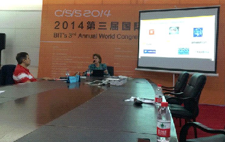

#世界雲端大會紀實 Big Data篇

2014-06

##一、會議簡介

BIT’s 3rd  Annual World Congress of Cloud Computing 2014 (2014世界雲端大會)本研討會已舉行至第三屆，由中國國際軟體與資訊服務高峰會(China International Software & Information Service Fair, CISIS 2014)為基礎，展開四大類主題研討會：分別為CloudCon, InfoTech, U-World, Cultural & Creative IT，聯經數位技術發展組研究員張凱迪受邀參加CloudCon 2014，屬於CISIS下之分支，探討雲端運算領域之技術與應用，CloudCon和InfoTech為CISIS分支中，前端技術議程(Frontier Technological Program)為全英文議程之研討會。

會議於大連世界會覽中心舉行，位於中國遼寧省大連市星海廣場旁，今年CISIS2014大會精神標語為：Smart City & Cool Life，代表「智城市、酷生活」，希望將中國大連打造成「智慧城市」，透過雲端服務及物聯網技術，結合Big Data發展各式各樣的應用，為人民帶來「玩酷生活」，其發展方向與報系近兩年努力的物聯網應用、智慧連網應用非常契合，顯見也是整體資通訊產業努力發展的方向。

##二、Keynote Speech
###2.1 華為智慧城市解決方案，現代城市智慧化助推器
####胡善勇/華為企業業務中國區總工, 中國信息安全學會常委

一開始從減肥的觀點切入演講，人與人之間的六分割理論，已經縮短為4.7分割，再轉化思考的觀點，也就是一個變胖，間接會影響4.7個人變胖，這是社會問題。從這個例子說明，以後思考問題的時候，要從網路和社會的思維出發。

華為認為未來城市是三層架構

在華為的看法，未來城市會是三層架構，最底層是城市網路，中間是城市資料中心，上面則是開放雲平臺，提供各式各樣的服務。

智慧化是問題的解決方案，華為提供軟體和硬體，並認為長期演進技術(Long Term Evolution, LTE)將是完成智慧城市版圖的最後一哩(Last mile)。未來的資料中心在基礎建設的物理概念是分散，但管理邏輯上是統一的。最終提及，要達到智慧城市有三個階段，分別是建設、維運、服務，未來「維運」將持續被優化，變成零人力，一切都透過雲端完成，人力將只投注在「建設」和「服務」之上，讓人脫離煩瑣的工作，可以投入人力在創造更多的價值。

##三、與會過程

會議的Sector 2為CloudCon2014之Frontier Technological Program，邀請雲端運算各領域學者專家齊聚一堂，CloudCon主題為：Chinese Dream in Cloud，依專業領域不同，共分六個子議程：

Cloud 2-1: Global Cloud Computing Economy-Strategy to Business
Cloud 2-3: Cloud Security and Privacy
Cloud 2-5: Cloud Solutions & Energy Efficiency
Cloud 2-2: Cloud Architectures and Applications
Cloud 2-4: Big Data & New Services in Cloud
Cloud 2-6: Global Cloud Computing Adoption

###3.1 報告簡介

研究員張凱迪於大會Cloud 2-4: Big Data & New Services in Cloud議程發表演講 - The Potential Cloud Business Model of Internet of Things - Case Study of Shopping Malls，以聯經數位事業發展部執行物聯網(IOT)專案之成果做案例分享，包含：

1. 以兩期信義商圈智慧聯網為案例，分享結合物聯網應用對百貨業型態轉變。
1. 透過計畫執行，讓業主應用行動載具與物聯網技術於場域中，開啟物聯網時代嶄新商業模式。
1. 透過雲端運算技術，滿足未來場域快速複製與使用者增量下服務穩定度與彈性，將是持續研究課題。

本公司張凱迪發表IoT專案的案例分享

###3.2 Cloud, Big Data and the “Next Big Thing”
Ms. Jacqueline Vanacek／Vice President, Cloud Evangelist and U.S. Cloud commissioner, SAP, USA

本主題由 Ms. Jacqueline Vanacek分享，她說紐約是一個Big data的好範例，在雲端有很多的資源資金投入，也指出「mobile is cloud in your pocket」，可見行動裝置和雲端的密切度，並提及個前端趨勢有：smart phone, data-driven health care, the last second economy, credit card are new platform，也強調每件事物都連網，跟mobile cloud結合，並且IOT變成smart transportation。除了mobile device外，各種穿戴式裝置與應用將開始普及，尤其是用在醫療(healthcare)方面的設備，未來的Big data應用有很大一塊會在「個人化醫療」出現，隨時隨地詳實記載生理健康訊號的每一部分，並且有大量的資料後端進行分析比對。

##四、參觀展覽

##五、結語

從本次研討會，歸納以下結語：

1. 資通訊產業發展積極往雲端運算、物聯網、Big Data領域邁進，此已是明顯趨勢，會需要搭著良好的基礎建設(有線、無線)進行，重點發展也需要政府與大型企業投入相對應資源。
1. 開放原始碼(Open Source)及開放標準(Open Standard)被多家大型公司採用，未來新服務與應用將以開放架構為基礎，並會是比誰佈署速度快的時代。
1. 資訊安全議題絕對是現有商業服務能否快速邁向雲端的優先考量，未來資管處與聯經數位均有符合CSA STAR導入顧問資格的同仁，能以雲端安全聯盟的標準，評估雲端服務及供應商的安全成熟度。
1. 資料的價值待擁有者挖掘發現，加值後的資料亦將是開創新事業的關鍵。

非常感謝公司提供此機會，讓筆者能到中國大連參加CloudCon2014研討會，一方面介紹聯經數位在智慧商圈專案執行成果，同時能跟多國專家交流心得，更看到中國大陸很有企圖心地展開下一個世代的市場與戰場，相信對我們來說，絕對是一個機會也是一個挑戰。