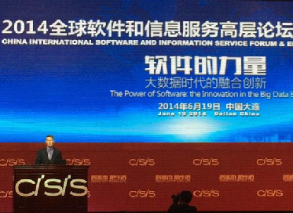
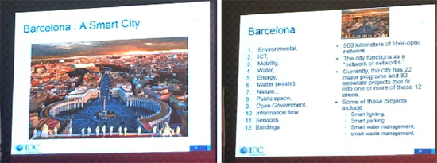
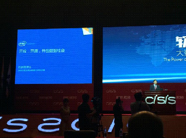
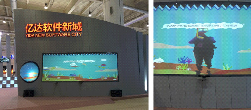
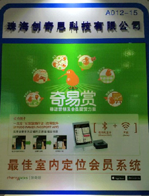
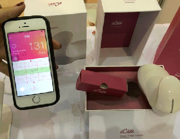
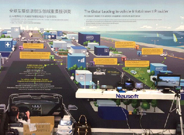
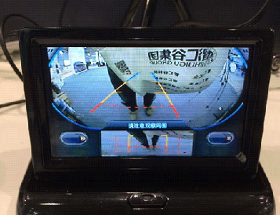
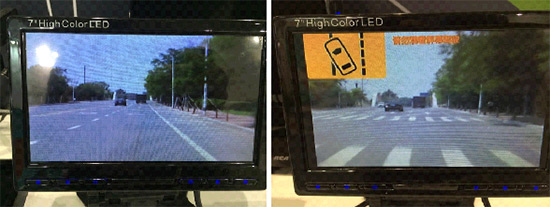

#2014世界雲端大會紀實 - The Internet of Thing 篇

2014-06

##一、會議簡介!
BIT’s 3rd  Annual World Congress of Cloud Computing 2014 (2014世界雲端大會)本研討會已舉行至第三屆，由中國國際軟體與資訊服務高峰會(China International Software & Information Service Fair, CISIS 2014)為基礎，展開四大類主題研討會：分別為CloudCon, InfoTech, U-World, Cultural & Creative IT，聯經數位技術發展組研究員張凱迪受邀參加CloudCon 2014，屬於CISIS下之分支，探討雲端運算領域之技術與應用，CloudCon和InfoTech為CISIS分支中，前端技術議程(Frontier Technological Program)為全英文議程之研討會。

會議於大連世界會覽中心舉行，位於中國遼寧省大連市星海廣場旁，今年CISIS2014大會精神標語為：Smart City & Cool Life，代表「智城市、酷生活」，希望將中國大連打造成「智慧城市」，透過雲端服務及物聯網技術，結合Big Data發展各式各樣的應用，為人民帶來「玩酷生活」，其發展方向與報系近兩年努力的物聯網應用、智慧連網應用非常契合，顯見也是整體資通訊產業努力發展的方向。

##二、Keynote Speech
###2.1 The Sustainability and Construction and Development of Smart Cities

####Vernon Turner
####Senior Vice President of IDC / IDC資深副總裁

Vernon首先提到未來30年人類的挑戰，將是如何運用資訊科技讓我們前往下一個未來。在雲端運算和物聯網的發展下，IDC認為未來將出現Digital University、Smart Connected City、而且由Internet of Things的成熟和廣泛發展創造智慧城市。

在IDC的分析下，2013年全球資訊量有4.4 Zettabyte，到了2020年的時候，承襲上述趨勢與發展，資料量將會達到44 Zettabyte(1ZB=1024EB，1EB=1024PB，1PB=1024TB)，也就是10倍的成長，再加上超過290億的連網裝置。

中國市場(新興市場)的產值，將在2018、2019年超越美國(成熟市場)，成為世界第一大的市場，隨後提及IDC預估，2035年的時候，七成的中國人口都會住在城市內，要支撐如此龐大的人口，城市就需要透過大量數位層疊(Digital Overlay)，也就是藉由在「Data Centric」、「System Centric」有良好的管理、使用和開發，讓現在的城市進化成Smart City。而Smart City會由Cloud Computing，Mobility，Social和BigData進行技術發展創新，其中又牽涉到四個關鍵議題：經濟發展、可持續性、市民參與和創新文化。

以巴塞隆納為例子，西班牙正積極打造巴塞隆納成為Smart City。
分成12個領域進行專案推展，包含領域有環境、資通訊、行動、水、能源、垃圾、自然、公共空間、開放政府、資訊流、服務、建築等。基礎設施的工程有達500公里的光纖網路，目標讓每個城市的功能就是「網路中的網路」，對應到規劃的12個項目，整體有22個主要計畫，分成83個專案進行。

巴塞隆納的Smart City專案架構分成3個科技層，同時也發展到第三代平台，三個層面分別是：IoT、Cloud&BigData和資料分享、分析。

Digital Universe將會由軟體建造和定義，從資料中分析尋找隱藏價值和新的機會，轉化到現實生活中。未來趨勢將是Big Data、Mobility、Social、Cloud發展和組成，市民變成作者，分享生活周遭的每件事物，同時，這些事物都會被Big Data用來分析和再利用。IDC也提及，未來IOT發展要考量Human IoT、Industrial IoT、Private Sector、Public Sector等面向，才能完善發展Smart City。

###2.2 Open， Open Source， Create Digital Society

####Jaskson He
####General Manager of Intel Asia and Pacific R&D Ltd.， Software and Service Group PRC

何博士分享Intel的方向，從open source的觀點出發，看未來怎麼建立數位社會。說明未來將是Digital Society，在數位社會中大公司扮演的角色以及Intel自己的方向。其中提到，單純的集中資料蒐集資料，其實只是消耗儲存空間，沒辦法創造價值。要能夠把這些資料分析並且加值，產生新的商品，才能在未來的數位社會找到自己的機會。

Intel積極布局各類運算環境，只要需要運算的地方，從小到汽車手機，大到電腦伺服器，甚至資料中心都不放過。Intel的目標是，支援任何需要運算的地方，就要讓該軟體在Intel的晶片上跑得最好，佈局讓運算晶片支援Windows、Android、iOS就可以看到Intel的野心和企圖。

因為設備海量，而且資料又有相當的變異性，該怎麼樣才能設計出自己蒐集資料的方法和架構?為了達到這個目的，Intel積極採用open source做為開發基礎，自稱是最大規模使用open source的公司，也符合何博士提到兩個準則：

1. Open system architecture – 採用開放的系統架構
1. Open source – 軟體的開放和透明

結合以上因素，大量採用open system architecture與open source，Intel重新定義基礎架構，說明software defined infrastructure，重新打造資料中心，建立開放的資料中心。並舉例說明：現今的資料中心，提供一個全新的服務需要數個月的時間，如果將資料中心架構，改由軟體定義，在服務建立流程上可以大幅減化繁複的作業流程，號稱只要幾分鐘就可以提供佈署新服務需要的資源。

Intel也透過這個open data center建立大數據平台，平台中間是hadoop， Cloudera，底層就是各類伺服器，網路和儲存空間，把分析應用和服務建構在此大數據平臺之上。

最後提及，所有人類正在歷經前所未有的變化和資料快速增加的時代，為了滿足這個時代需求，在這個時代生存，對於這些快速增加資料的處理，採用Open Source將會是開創數位社會的基礎。並且，未來的數位社會解決方案，會需要大量點到點、終端到終端的應用，這些應用需要強大的生態系統來進行擴展(也就是大數據平臺)，現在也是開展服務的最佳時機，是大家比快的時代。

##三、與會過程

會議的Sector 2為CloudCon2014之Frontier Technological Program，邀請雲端運算各領域學者專家齊聚一堂，CloudCon主題為：Chinese Dream in Cloud，依專業領域不同，共分六個子議程：

* Cloud 2-1: Global Cloud Computing Economy-Strategy to Business
* Cloud 2-2: Cloud Architectures and Applications
* Cloud 2-3: Cloud Security and Privacy
* Cloud 2-4: Big Data & New Services in Cloud
* Cloud 2-5: Cloud Solutions & Energy Efficiency
* Cloud 2-6: Global Cloud Computing Adoption

###3.1 報告簡介

研究員張凱迪於大會Cloud 2-4: Big Data & New Services in Cloud議程發表演講 - The Potential Cloud Business Model of Internet of Things - Case Study of Shopping Malls，以聯經數位事業發展部執行物聯網(IOT)專案之成果做案例分享，包含：

1. 以兩期信義商圈智慧聯網為案例，分享結合物聯網應用對百貨業型態轉變。
1. 透過計畫執行，讓業主應用行動載具與物聯網技術於場域中，開啟物聯網時代嶄新商業模式。
1. 透過雲端運算技術，滿足未來場域快速複製與使用者增量下服務穩定度與彈性，將是持續研究課題。

本公司張凱迪發表IoT專案的案例分享

##四、參觀展覽

###4.1 億達軟件新城

使用Kinect跟使用者互動成像，把人加上呼吸管跟潛水鏡後呈現，但效果可以再加強。

###4.2 珠海創奇思科技有限公司

室內會員定位系統，核心技術為藍芽(藍芽4.0以及iBeacon)和聲波定位。

###4.3 WESOFT (慧訊軟件)

####4.3.1 智慧汽車市場服務解決方案

* 透過手機診斷車輛行駛狀況，包含行車體檢，過程診斷，定位地圖等。
* 車子利用藍芽跟手機連結，可以知道水溫、電壓、車窗沒關提醒、車門* 沒鎖提醒、分析駕駛行為、判斷有無急加減速、疲勞駕駛、行李箱沒關、車燈沒關、胎壓異常、行車記錄與油耗分析。
* 與維修技師的遠端診斷跟車友的社交分享。

####4.3.2 智慧醫療解決方案

* 提供雲端服務、透過網頁穿戴醫療設備查看數據。
* 七日健康紀錄走路步數消耗熱量。
* 血壓記錄、脈搏紀錄、血糖記錄。
* 體重紀錄分析，線上營養師建議攝取食物。
* 心律觀測。

####4.3.3 智慧家庭解決方案

* 空調飲水機、窗簾、保全、燈光、攝影機、音響。
* 以iOS， Android做為操作載具，無線通訊技術有WiFi、Bluetooth、Zigbee。
* App設定熱水器溫度，切換假期模式、開關熱水器。
* App設定空調溫度。
* App控制新風機(Air Purifier)清淨機、檢測二氧化碳濃度。
* 智慧場景模式，連動音響、燈光、門禁、煙霧、瓦斯等。
* 提供智慧開關，以行動載具操作窗戶、電燈。
* 雲端結合攝影機跟居家設備連繫。

###4.4 北京瑞智和康科技

快樂媽咪胎語儀

* 利用都普勒校應設計設備。
* 蒐集胎心音資訊並記錄心跳曲線。
* 透過燈號轉化胎兒心跳把聽不到的頻率轉為燈號呈現。
* iPhone、iPad、Android記錄數據聲音。
* 相關資料可以透過社群軟體分享。

###4.5 悅宏旭昂

號稱物聯網智慧城市引領者，高科技新創公司，有以下產品：

* 智慧停車場。
* 風景區智慧防侵入系統。
* 智慧養老監控系統。
* 軍隊槍枝管理系統。
* 人車物物聯網管理系統。
* 灌溉自動化管理系統。
* 無線監控管理系統。
* 智慧電網。
* 智慧化路邊停車收費。
* 智慧車位誘導。
* 無線網路感測器蒐集車位資料。
* 透過無線地磁，無線車位車牌偵測器，對車輛定位並提供動態引導。
* 透過APP查車位。

###4.6 Neusoft

Car View Guard智慧安全行車系統，直接讀取行車影像，提供各種預警功能，例如：倒車碰撞預警、車道偏離預警、前方碰撞預警、行人碰撞預警、換道輔助、限速提醒、紅綠燈提醒、疲勞提醒等。

倒車雷達與畫面分析

透過行車影像模擬分析，左圖為原始影像。右圖為分析結果，可判斷車輛有偏移的情況出現。

##五、結語

從本次研討會，歸納以下結語：

1. 資通訊產業發展積極往雲端運算、物聯網、Big Data領域邁進，此已是明顯趨勢，會需要搭著良好的基礎建設(有線、無線)進行，重點發展也需要政府與大型企業投入相對應資源。
1. 開放原始碼(Open Source)及開放標準(Open Standard)被多家大型公司採用，未來新服務與應用將以開放架構為基礎，並會是比誰佈署速度快的時代。
1. 資訊安全議題絕對是現有商業服務能否快速邁向雲端的優先考量，未來資管處與聯經數位均有符合CSA STAR導入顧問資格的同仁，能以雲端安全聯盟的標準，評估雲端服務及供應商的安全成熟度。
1. 資料的價值待擁有者挖掘發現，加值後的資料亦將是開創新事業的關鍵。

非常感謝公司提供此機會，讓筆者能到中國大連參加CloudCon2014研討會，一方面介紹聯經數位在智慧商圈專案執行成果，同時能跟多國專家交流心得，更看到中國大陸很有企圖心地展開下一個世代的市場與戰場，相信對我們來說，絕對是一個機會也是一個挑戰。