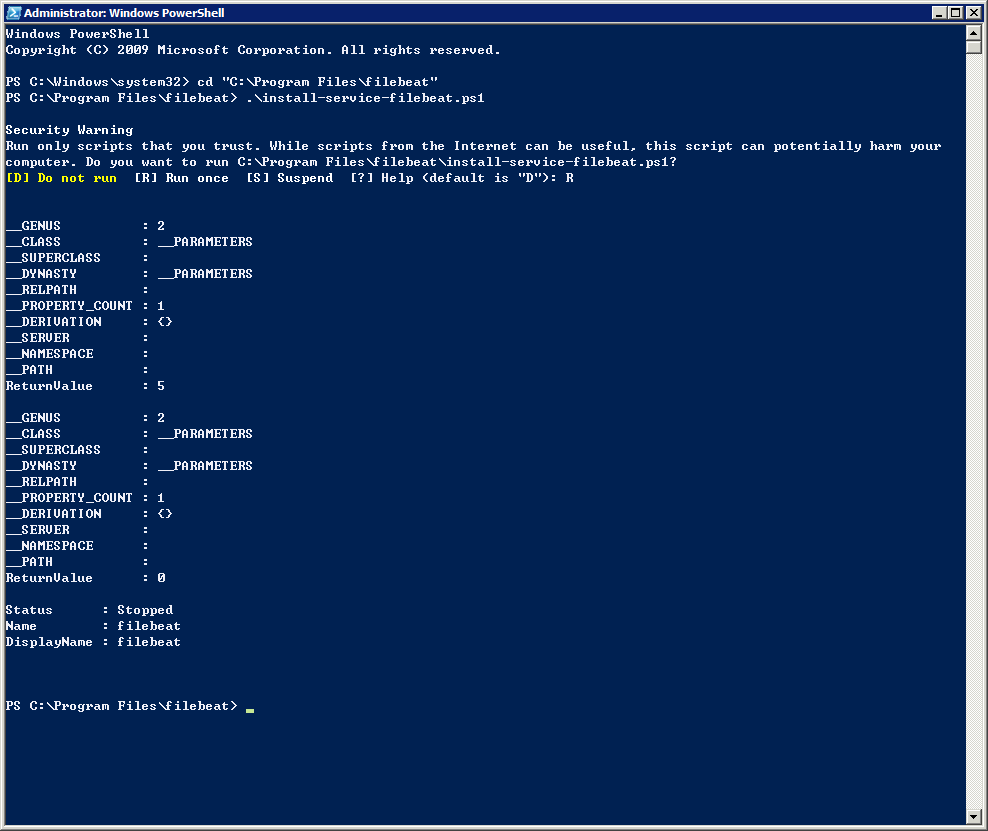
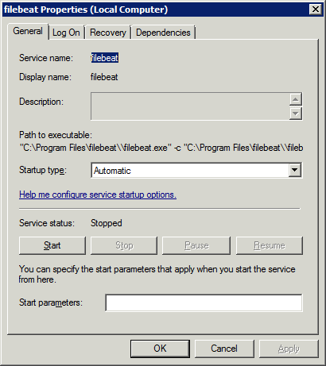

# Filebeat - Installation

以前要傳送日誌到logstash是使用logstash forwarder，現在都已經改用新的Filebeat。

Filebeat是基於Logstash-Forwarder原始碼開發的下一代即時日誌資料轉送代裡程式，會以服務/代裡(Agent)的方式安裝在監控標的(伺服器/電腦). 安裝完成以後會監控特定目錄下的日誌檔案，追蹤檔案之後可以轉傳到Losstash進行解析或直接傳到ElasticSearch建立索引。

Filebeat主要適合Linux下的log監控，如需要Windows Event Log則須另外安裝Winlogbeat。

## Filebeat on Windows

我們先試著在Windows 7上使用Filebeat傳送日誌到我們建立的logstash，再傳送到ElasticSearch叢集。

Windows版本可以從這裡下載:
https://download.elastic.co/beats/filebeat/filebeat-1.0.1-windows.zip

解壓縮以後可以看到好幾個檔案，就先放到C:

* filebeat.exe
* filebeat.template.json
* filebeat.yml
* install-service-filebeat.ps1
* uninstall-service-filebeat.ps1

首先，在Windows的powershell，將filebeat安裝成服務。
第一次使用的時候，會有簽章問題而無法執行，所以先在powershell中，不限制

    Set-ExecutionPolicy Unrestricted
    [Y]

第二，執行安裝filebeat服務的ps，一樣在powershll中執行

    PS > cd 'C:\Program Files\Filebeat'
    PS C:\Program Files\Filebeat> .\install-service-filebeat.ps1
    [R]

為了安全，可以再把未簽章執行限制放回去

    Set-ExecutionPolicy Restricted
    [Y]

安裝完成可以看到PowerShell顯示的歷程

以及透過服務(services.msc)可以看到filebeat服務已順利安裝。

接著編輯 filebeat.yml 設定日誌如何轉送到logstash或ElasticSearch

