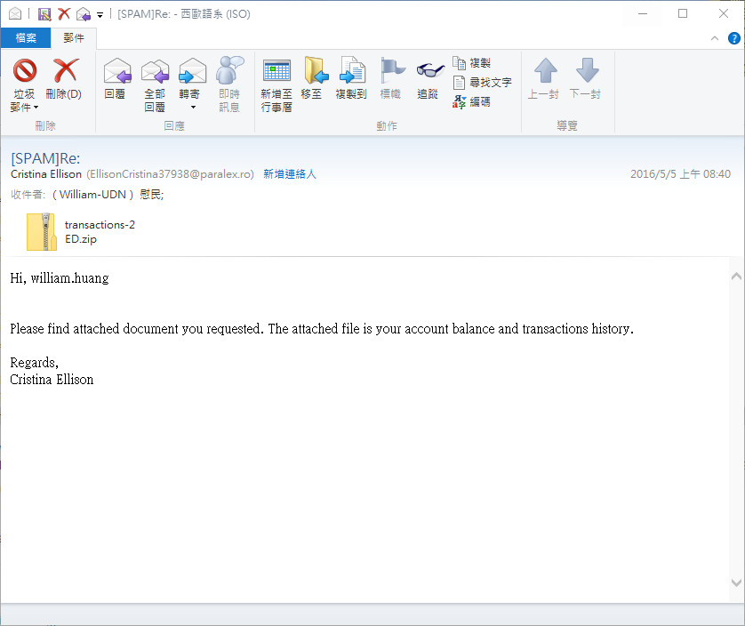
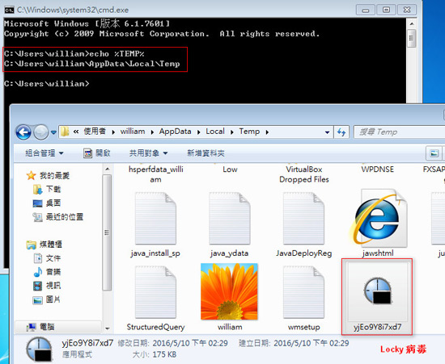
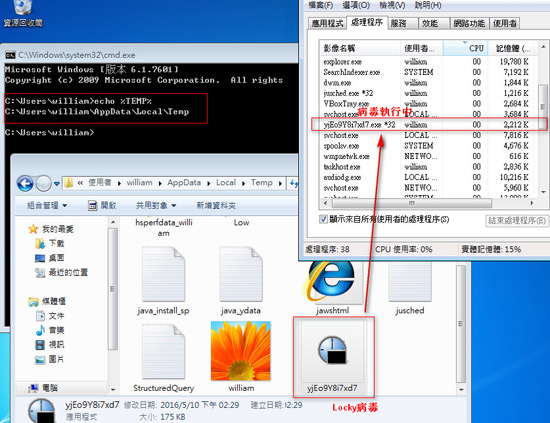
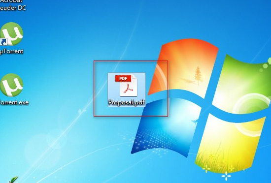
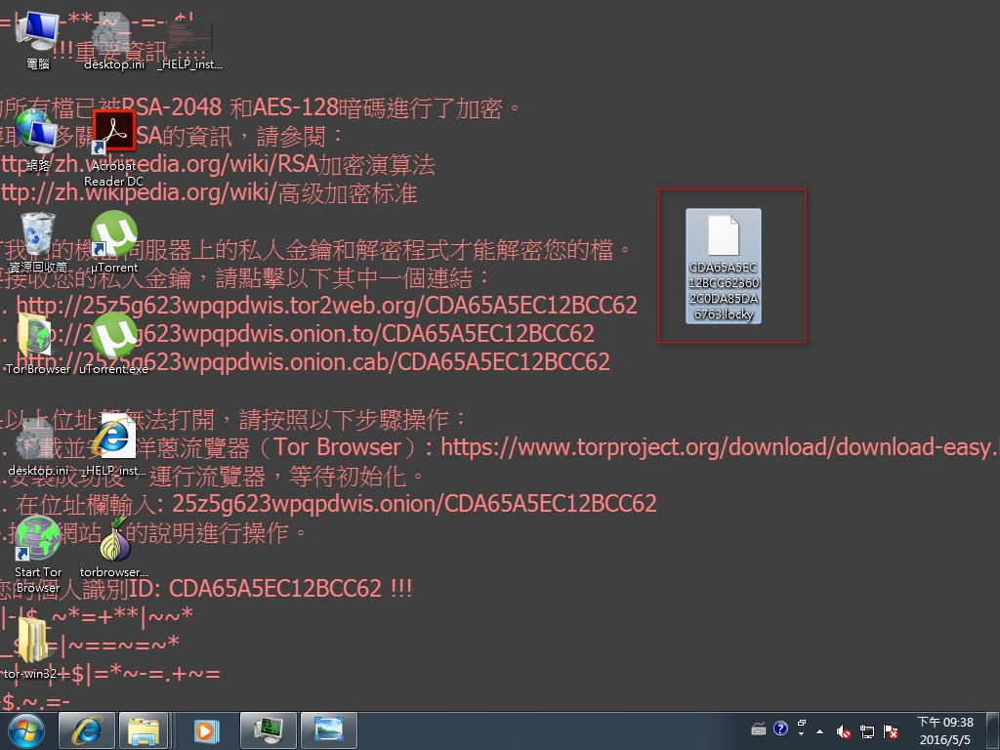
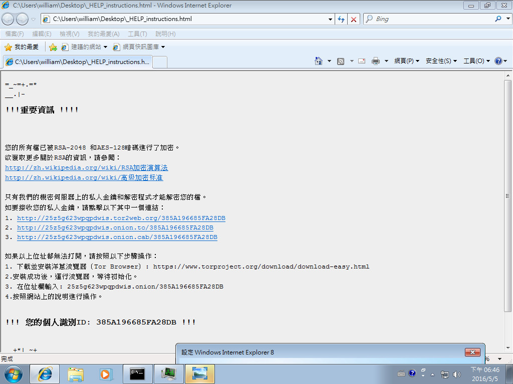
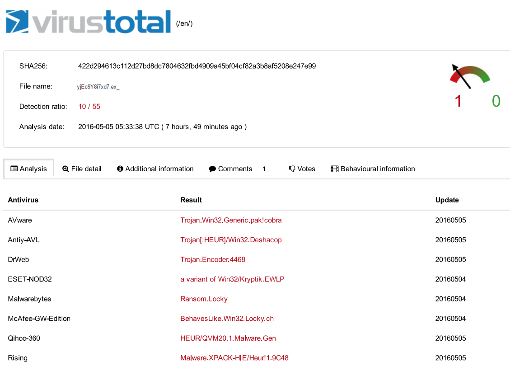
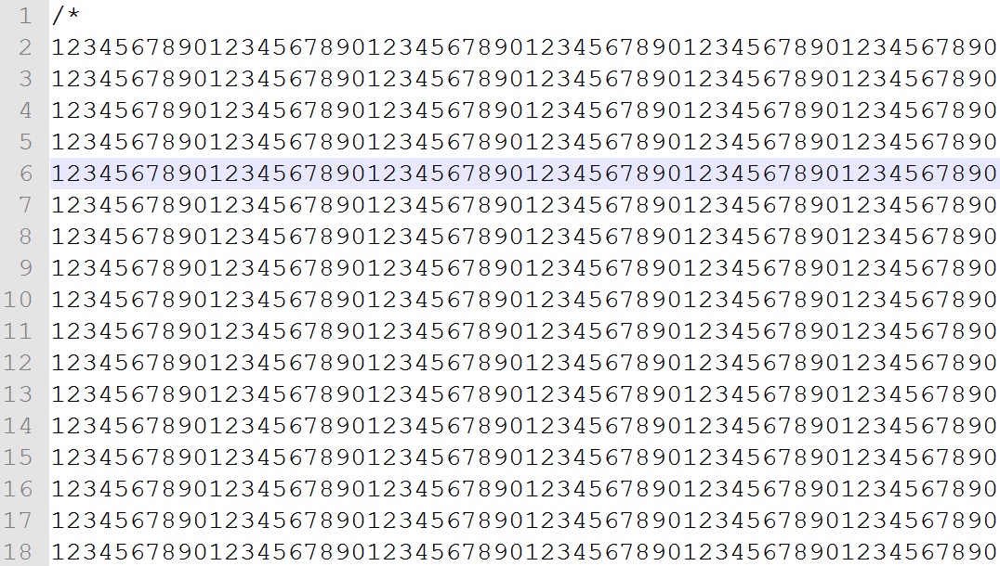
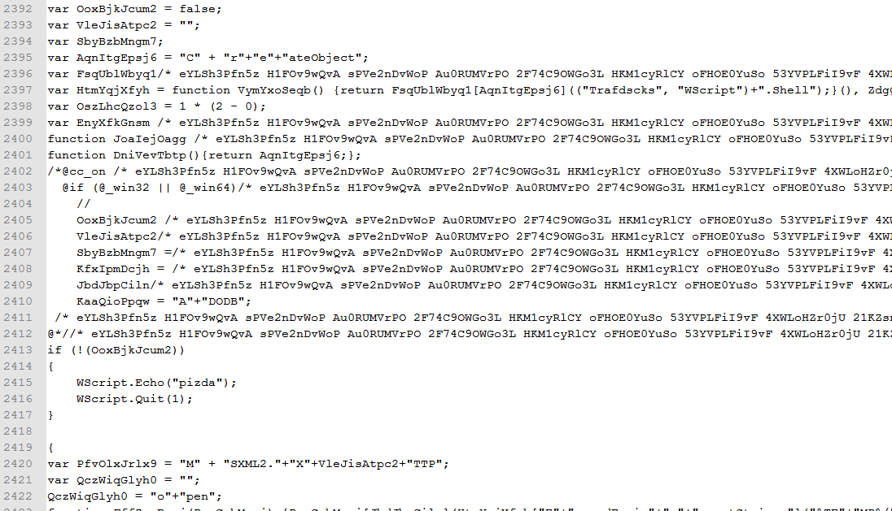
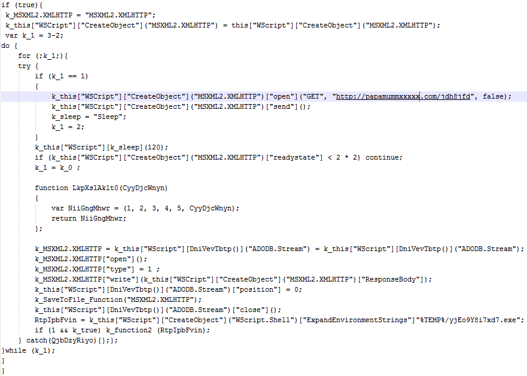

# 親愛的，我把檔案「加密」了
2016-05 黃慰民、張凱迪、張珈語

本文由黃慰民主任進行分析，張凱迪主筆撰寫，張珈語協同作業。

##一、前言：

如果看到題目，覺得檔案被加密保護是一件「很好」的事情，那您應該是還沒搭上勒索病毒的熱潮，資管部於20160505發佈公告：

近來「勒贖病毒」猖獗，一旦中毒將造成電腦檔案被加密鎖住無法使用的窘境，其主要散播途徑有「釣魚郵件」「網頁惡意連結」「flash 漏洞」，請同仁保持警覺，建議因應作法：

1. 勿開啟email 附件副檔名為 .js 或壓縮檔內含之 .js 檔案，這些通常是下載並執行勒贖病毒的木馬程式！！ 
1. 避免瀏覽色情、暴力、賭博、電玩等資安風險較高且非作業所需的網站。
1. 請隨時留意更新/修補 flash player。

電腦地宮的世界裡，有正直善良的駭客(Hacker)也有居心叵測的黑客(Cracker)。這是全民連網的時代，資訊觀念紮實與技術技巧純熟底子深厚的地宮黑客們，透過各種不同的手法刷存在感展示技術演化到牟取利益。從以前企業或大型組織面臨的持續滲透威脅，不自覺的檔案外洩或金融系統被侵蝕，到現在直接衝擊到每個使用者的電腦，直接把你的檔案加密，達到最終的目的，跟你勒索要錢。

##二、觀念宣導：

進入案例說明與手法分析之前，先來段概念宣導，怕你不想看太長的系刊就關掉了：

###2.1 停用Windows Script Host服務

幾起勒索軟體常見的入侵到電腦的方法，都是誘拐使用者執行壓縮檔案中附帶的Java Script檔案(副檔名為.js)，這些JS會偷偷呼叫Windows作業系統的Windows Script Host服務，連線到存放惡意加密程式的網站，下載惡意程式的檔案回來執行。因此，在不影響生產作業以及日常辦公的前提下，建議停用Windows Script Host服務，能夠減少被勒索軟體入侵的管道。[停用Windows Script Host組態檔[1]](https://goo.gl/svQF88)，下載解壓縮後點兩下"1停用WSH.reg"匯入即可。如果同仁執行日常業務需要[啟用Windows Script Host服務[2]](https://goo.gl/TTzli0)，可以下載點解壓縮點選"2啟用WSH.reg"檔案執行恢復服務，背後的原理參考F-Secure[3]或綠色工廠[4]的網誌。

###2.2 備份重要文件

平常應習慣重要文件備份，國內網路安全巨擘趨勢科技介紹了世界備份日(World Backup Day)三二一原則[5]，概念為

1. 至少備份__三__份
1. 使用__兩__種不同形式
1. 其中__一__份備份要存放異地。

詳細請參趨勢科技撰寫的文章，在此不多描述，原則主要作為規劃參考而非奉為一成不變的圭臬，重點是依照自己能力與狀況規劃備份方式，養成定時備份的好習慣。筆者自己家中的資料備份是本機一份、同地非即時網路磁碟一份、異地兩份、雲端硬碟再一份，做到五份的備份。同地網路磁碟強調非即時連線的原因是勒索病毒會搜尋並加密你連線中的磁碟，如果平常就透過網路上的芳鄰隨時連線著，萬一使用的電腦中毒、連線著的網路磁碟裡面存放的檔案，就跟著一起被加密了。如果檔案有備份在同地的網路磁碟，而且平常不會直接連線著，可以降低萬一中勒索病毒時候的損失。而採用雲端硬碟同步，出問題有個退版或往回復原的機制在。

###2.3 自己做好把關人

資管部的公告可以濃縮成三句話，再加上一點叮嚀：

1. 莫名檔案不要亂開 - 來路不明的附加檔案、撿到的隨身碟、Java Script檔案、簡訊連結等，不清楚不明白的不要亂碰。
1. 奇怪網站不要亂上 - 無關工作的廣告、賭博、電玩、影音、非法軟體，都是吸引使用者點選的誘因。
1. 軟體系統不忘更新 - Flash Player、Windows作業系統漏洞多，要定期修補，不要門戶大開。
1. 中毒直接拔電通報 - 萬一發現檔案出現「被加密」的狀況，直接把電源切掉、電線拔掉，不要透過Windows正常關機，我們無法確定病毒跟奪魂鋸JIGSAW一樣[6]偵測到關機而有額外動作，有的病毒會偵測到關機訊號把自己毀屍滅跡或是轉而開始刪除檔案，碰到此狀況就直接拔電並且通報資管部2756。

要注意的事情是，這些觀念跟方法都只在降低入侵的管道，不代表就不會被入侵，資訊安全管理就是在合理的人力物力與財力的範圍內，盡量降低可能的風險，但最大的風險還是人，畢竟，釣魚網站、社交工程、廣告綁架這些內容，都是經過使用者按下了「同意」、「是」、「OK」，這些惡意軟體才有權限跟我們的電腦進行第一次親密接觸，請務必保持警覺小心防範。

##三、勒索病毒簡介與真實案例：

勒索軟體是一種惡意病毒，讓使用者失去對系統或資料的控制權利，只有透過支付贖金後才能索取資料，但有時支付贖金也未必取回資料。實務上我們不鼓勵支付贖金，因為會助長此種病毒的孳生，因此該有的觀念希望大家能夠遵守，才能降低資安事故發生的機率。

早期的勒索病毒，以單純鎖住電腦螢幕或透過警告，偽裝當地警察機構，結合當地語言，贖金以罰款方式呈現。後來可能付贖金的人太少，威力就增強了，2013出現麻煩的勒索軟體稱為Cryptolocker，會加密電腦裡面重要的文件檔案，只有透過難以追查金流的比特幣支付贖金才能取得解密方法與金鑰。而這些勒索病毒怎麼進入我們的電腦中呢？通常會結合社交工程，針對個人或企業用不同的名義製造電子郵件，將惡意信件寄到個人或公司中。例如偽裝求職信配合吸引人的標題或內文讓使用者打開附加檔案，入侵系統執行加密檔案後會限制支付贖金的時間，透過心理作用，讓使用者產生緊張感，如果不付贖金，資料將永遠無法取得，檔案跟文件就像是被撕票一般，再也回不來了，令人防不勝防。完整的勒索病毒介紹，請參考趨勢科技2016勒索軟體白皮書[7]，以下直接以現有案例說明。

資管部同仁William收到釣魚信件，信件內容偽裝成銀行帳戶相關資訊，由於平時就養成的警覺心，便開始一連串分析，如果同仁們掉以輕心，很容易讓自己陷入中毒的風險。

故事是這樣的，2016/05/05上午08:40收到了一封電子郵件，偽裝成貼心的專員，跟您說道：用戶你好，之前你說要一份帳戶餘額跟交易明細，現在我把檔案寄給你囉！有沒有很貼心阿？而且主旨還是Re:開頭的回覆郵件，弄得煞有其事的樣子，不小心可能順手打開附加檔案觀看了。

繼續按照圈套走，打開附加檔案transactions-2ED.zip，登登，接著電腦開始執行隱藏在其中的js檔案，然後，沒有幾分鐘的時間，電腦多了一隻程式，名稱為yjEo9Y8i7xd7.exe。

默默的來到暫存資料夾上，而且打開工作管理員看，這病毒已經在執行了喔！

我們在桌面上準備好了要讓勒索病毒加密的文件檔案，這是加密前的檔案，長得一副PDF的樣子：

原本是PDF，加密完成以後就變了一個樣，經過加密以後保證連他媽媽都認不出來。

勒索軟體還怕你桌面上太多圖示會看不懂，會自己開啟瀏覽器，告訴你詳細的破關祕笈。

這時候，我們的電腦就真真切切確確實實的中了勒索病毒，被加密的檔案也打不開了(除非支付贖金)。整個過程沒有多久的時間，我們的電腦就像是換了一台一樣，重要的結晶跟心血都幫你加密保護得好好的，還讓我們欲哭無淚。

假設之前都沒碰過，看到這些畫面會稍微有感覺些。因為，社交工程郵件、加密勒索軟體，其實就在你身邊。如果檔案很重要又沒有備份，就只能乖乖付贖金，相信大家都不希望會有看到這個畫面的一天。所以養成重要的電腦使用與檔案備份習慣，是非常重要的事情，請詳閱公告以及前一段的重要觀念宣導。

##四、手法分析：

對技術手法有興趣的同仁，可以繼續閱讀，如果對細節沒有太多心力關注，可以直接跳去看結論。

黑客會透過各種方式，騙取使用者點集連結，利如：E-mail、網頁廣告，只要使用者不小心點選連結或開啟附件，就會觸發一系列的動作，最終將使用者電腦中的檔案加密。

可能會有同仁有疑問，我們不是有防毒軟體？為什麼本案例中防毒軟體都沒有跳出警示呢？一方面是這隻Locky勒索病毒還很新，很多防毒軟體還不認得，把案例中的Locky病毒(yjEo9Y8i7xd7.exe)送到virustotal[8]讓防毒軟體們進行分析，得到的偵測率只有10/55，也就是55套防毒軟體引擎只有10套認得這隻病毒，實在還很幼齒、稚嫩。(補充：截至2016/05/13偵測率已大幅提高)

那這隻病毒怎麼進來的呢？就在於該封電子郵件壓縮檔(transactions-2ED.zip)裡面的transactions 09445.js檔案，讓人以為它是交易紀錄明細，欺騙使用者點兩下達到執行的效果，偽裝過的transactions 09445.js乍看，不知道是一隻惡意程式的下載前導，檔案前面區段用了大量的註解跟變數變換，用來偽裝跟躲避智慧型防毒軟體的偵測。

經過還原以後，可以看到該JS的樣貌，大致上會透過Windows Script Host服務，在背景取得 "http://papamummxxxxx.com/jdh8jfd"之後，重新命名為yjEo9Y8i7xd7.exe，然後送出執行程式，上述過程都在背景執行，會讓我們看到的時候，已經開始加密，就是前一章介紹的過程。

##五、結論：

一連串的手法，都是黑客為了把惡意的加密程式放到你電腦裡面，然後開始執行，這些容易讓我們掉以輕心的手法，就是社交工程。資管部也會定期舉行社交工程演練，看看同仁們是否會備標題或內容吸引，進而打開電子郵件、點選附加檔案或裡面的連結，當我們收到一些信件的時候可以先思考：這封信該不該出現在這裡，例如：Paypal通知我的帳號付了多少錢、轉帳交易通知等；如果是公務信箱，甚至不該拿來收這類私人信件，未來看到這類信件就可以先提升自己的警覺心。

好奇心會殺死一隻貓，想殺死貓的那個人會透過很多方法降低你的警覺心、提升你的好奇心，讓你打開潘朵拉的盒子，下次打開附加檔案前務必要記得多想想囉！

##參考資料

1. 停用Windows Script Host服務組態檔
1. 啟用Windows Script Host服務組態檔
1. F-Secure, “How to disable windows script host,” 2016.[Online]. Available: https://labsblog.f-secure.com/2016/04/19/how-to-disable-windows-script-host/ [Accessed:10-May-2016]
1. 綠色工廠,“勒索軟體預防針，停用 Windows Script Host 功能，不要放棄治療,”[Online]. Available:http://portable.easylife.tw/5016 [Accessed: 10-May-2016]
1. 趨勢科技,“世界備份日( World Backup Day)：三二一原則,”2016.[Online].Available: http://blog.trendmicro.com.tw/?p=4707 [Accessed:10-May-2016]
1. 趨勢科技,“《奪魂鋸》殺人魔化身勒索軟體 JIGSAW:重新開機,刪除 1,000 個檔案;未在72小時內付款,刪除所有加密檔案,”2016.[Online]. Available: http://blog.trendmicro.com.tw/?p=17619 [Accessed: 10-May-2016]
1. 趨勢科技,“2016勒索軟體白皮書,”2016.[Online].Available:http://blog.trendmicro.com.tw/wp-content/uploads/2016/04/2016-ransomware-white-paper.pdf [Accessed:10-May-2016]
1. Virustotal,https://virustotal.com/ [Accessed:10-May-2016]