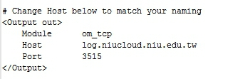
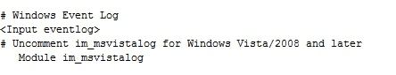

# NXLog - Installation
NXLog是專門收集Windows Event Log的一個套件

參考: https://www.loggly.com/docs/logging-from-windows/

NXLog & Logging From Windows

下載網址:http://nxlog.org/products/nxlog-
community-edition/download


執行完nxlog-ce-2.9.1504.msi
預設路徑C:\Program Files (x86)\nxlog\conf\nxlog.conf(此組態檔為簡單版需更新到我們所需求)

下載更新組態檔並取代: https://gist.github.com/mrlesmithjr/cf212836b9ce162373ed#file-nxlog-conf

Note:

1.更新Host位址相關資訊



2.Windows Event Log設定

因為我們要取得Windows Event Log相關資訊，而在ElasticSearch平台訊息對應不上欄位，所以我們在Windows Event Log用以下程式碼取代。
```
# Windows Event Log
<Input eventlog>
# Uncomment im_msvistalog for Windows Vista/2008 and later
    Module      im_msvistalog
    ReadFromLast FALSE
    SavePos     FALSE
    Query       <QueryList>\
                    <Query Id="0">\
                        <Select Path="Application">*</Select>\
                        <Select Path="System">*</Select>\
                        <Select Path="Security">*</Select>\
                    </Query>\
                </QueryList>
# Uncomment im_mseventlog for Windows XP/2000/2003
#   Module im_mseventlog
```

之後在命令提示字元下 Services nxlog.exe


在服務內啟動，即完成。


