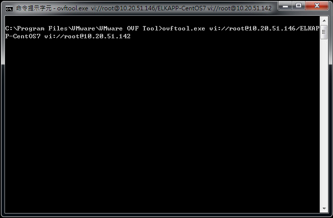

# 使用ovftool進行跨VMware ESXi Hypervisor Host間的虛擬主機複製

##從VMware官方網站取得ovftool
https://www.vmware.com/support/developer/ovf/

##確定來源與目的

###來源描述格式

    username@hostname/vm-name

範例

    root@10.20.51.150/ELKAPP-CentOS7

###目的描述格式

    username@hostname

範例

    root@10.20.51.141

###Windows命令格式

    ovftool.exe vi://root@10.20.51.150/ELKAPP-CentOS7 vi://root@10.20.51.141/

##Linux命令格式

    ovftool.exe vi://root@10.20.51.150/ELKAPP-CentOS7 vi://root@10.20.51.141/

##使用ovftool

@Windows 開啟command prompt 執行以下命令

    C:\Program Files\VMware\VMware OVF Tool>ovftool.exe vi://username@hostname/vm-namevi://username@hostname/

輸入會提示該host的密碼

從vmware vsphere會看到正在使用OVA佈署

完成以後就可以看到目的端的VM多長了一台出來。

以上就完成了使用ovftool進行跨VMware ESXi主機VM複製的過程，因為複製完畢之後，原採用ThinProvision配置的大小會占用配置的磁碟空間(變成Thick)，所以有此困擾的人，再繼續往下參考。

##vmdk空間問題

環境中，實際硬碟大小1TB(用1024為基底算起來為932GB)，配置給VM大小是900GB (thin provision)，使用ovftool佈署以後的大小回到配置的900GB，有點肥大，碰到磁碟空間炸裂後VM無法啟動，因為剩下的空間不夠硬碟+VMware的swap分區使用，就不能直接啟動虛擬機器，因此，在本地使用vmkfstooks重新clone檔案。

##使用vmkstools複製vmdk
使用SSH登入VMware ESXi主機，使用以下命令進行vmdk複製，讓他空間先不要占到900GB，以下是我的環境，請依照實際管理習慣與狀況調整：

    mkdir /vmfs/volumes/datastore1/ELKAPP01-CentOS7

    vmkfstools -i "/vmfs/volumes/datastore1/ELKAPP10-CentOS7/ELKAPP10-CentOS7.vmdk" "/vmfs/volumes/datastore1/ELKAPP01-CentOS7/ELKAPP01-CentOS7.vmdk" -d thin

vmkfstools執行完畢。

刪除OVA佈署以後肥大的VM，上圖可以看到是ELKAPP-CentOS7很肥大，最後重新建立VM組態資料，我們環境是給1 socket，8 cores，32GB RAM，就可以開機囉！

以上，打完收工。

