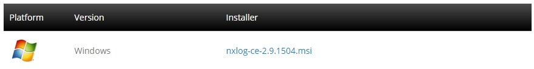
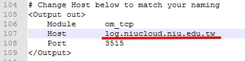
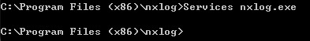
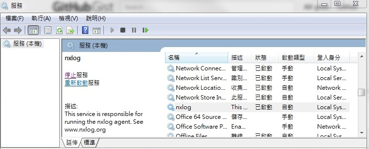

# Windows Event Log - Installation
參考: https://www.loggly.com/docs/logging-from-windows/

NXLog & Logging From Windows

下載網址:http://nxlog.org/products/nxlog-
community-edition/download

執行完nxlog-ce-2.9.1504.msi
預設路徑C:\Program Files (x86)\nxlog\conf\nxlog.conf(此組態檔為簡單版需更新到我們所需求)

下載更新組態檔並取代: https://gist.github.com/mrlesmithjr/cf212836b9ce162373ed#file-nxlog-conf

Note:
在程式碼第107更新Host位址相關資訊

之後在命令提示字元下 Services nxlog.exe

在服務內啟動，即完成。

