# Winlogbeat - Installation

安裝winlogbeat需要透過Go程式來編譯

(提醒:沒有的資料夾名稱自己創)

##(一)、Go程式安裝說明
下載安裝檔: https://golang.org/doc/install?download=go1.5.2.windows-amd64.msi

預設路徑C:\Go

環境變數設定(設定完後記得重新開機)

| 路徑| 說明|
| -- | -- |
| PATH:C:\Go\bin | 設定執行檔go.exe路徑|
| GOROOT:C:\Go\ | 安裝路徑 |
| GOPATH:C:\Projects\windows | 編譯資料路徑(如我們要編譯的資料winlogbeat) |
打開命令提示字元

輸入go，出現以下圖表示成功。

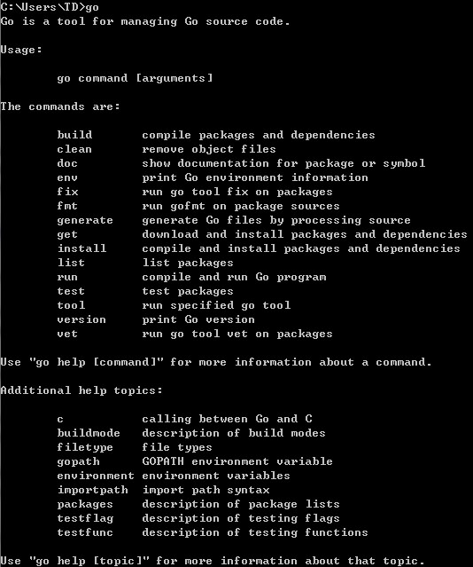
##(二)、winlogbeat安裝說明
下載安裝檔: https://github.com/elastic/beats

(winlogbeat是在beats資料夾內，編譯時也需用到其他資料內容)。

因(一)環境變數設定為GOPATH:C:\Projects\windows把下載檔案beats-master放入windows資料夾，進入命令提示字元到winlogbeat資料夾執行make.bat。
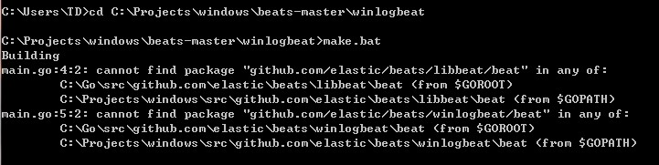

在Building過程中，先產生bin與src資料夾。
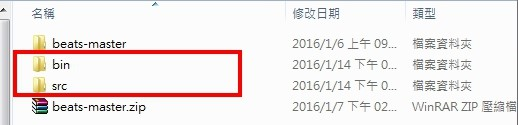

並且把beats-master改名為beats放入C:\Projects\windows\src\github.com\elastic資料夾內，
在執行Building出現的錯誤，是因為缺少其它套件，需額外下載到對應資料夾。
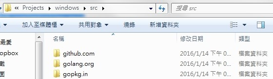
### 放入github.com資料夾內

1.garyburd/redigo/redis
網址下載https://github.com/garyburd/redigo

2.joeshaw/multierror
網址下載https://github.com/garyburd/redigo

3.nranchev/go-libGeoIP
網址下載https://github.com/nranchev/go-libGeoIP

4.satori/go.uuid
網址下載https://github.com/satori/go.uuid

###放入golang.org資料夾內
golang/sys
網址下載https://github.com/golang/sys

###放入gopkg.in資料夾內
yaml.v2
網址下載https://github.com/go-yaml/yaml

下載至對應資料夾後，再次執行make.bat後，winlogbeats資料夾會產生
winlogbeat.exe執行檔，是之後設定組態檔所需的檔案，而上圖Testing有錯誤不需理會，因為檔案內的測試文件不完整，而我們也不需要用到測試檔。
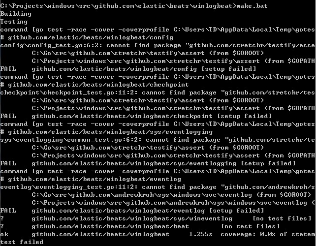
##(三)、組態檔設定

###Step1
* 因找不到相關檔案所以有技巧從Filebeat on Windows資料修改。
* 下載檔案: https://download.elastic.co/beats/filebeat/filebeat-1.0.1-windows.zip
* 解壓縮後可以看到檔案內容為以下，而我們只需要install-service-filebeat.ps1服務設定
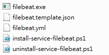
* 修改成我們要的所要檔案名稱install-service-winlogbeat.ps1，檔案內容全部修改為winlogbeat。
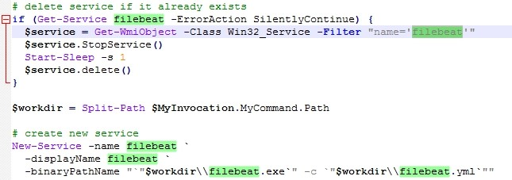

###Step2
* (二)Building產生的winlogbeat.exe、
* 資料夾C:\Projects\windows\github.com\elastic\beats\winlogbeat\etc內的winlogbeat.template.json與winlogbeat.yml兩個文件
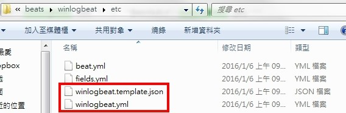
Step1與Step2資料一併放入C:\Program Files\winlogbeat資料夾目錄內。
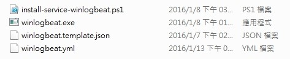
Note:
在winlogbeat.yml中可以設定更改hosts位址、使用者帳號與密碼。
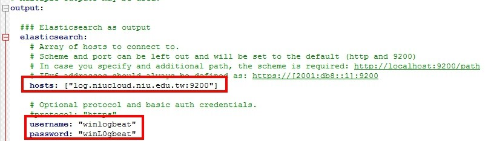

###Step3
首先，在Windows的powershell，將winlogbeat安裝成服務。第一次使用的時候，會有簽章問題而無法執行，所以先在powershell中，不限制。
```
Set-ExecutionPolicy Unrestricted
[Y]
```
第二，執行安裝filebeat服務的ps，一樣在powershll中執行。
```
PS > cd 'C:\Program Files\winlogbeat'
PS C:\Program Files\winlogbeat > .\install-service-filebeat.ps1
[Y]
```
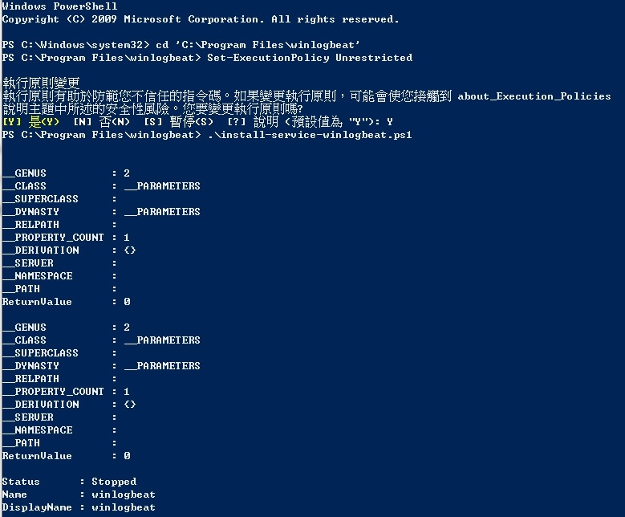
為了安全，可以再把未簽章執行限制放回去。
```
Set-ExecutionPolicy Restricted
[Y]
```
###Setp4
在開始輸入services.msc把winlogbeat服務啟動，即完成。
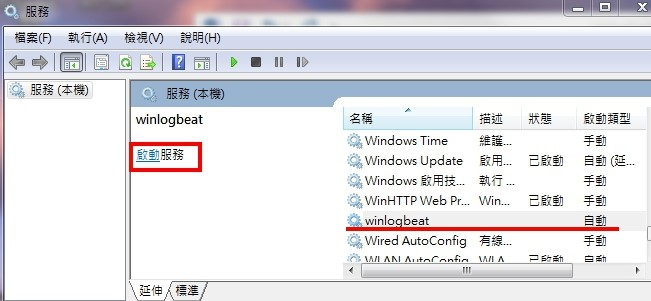
