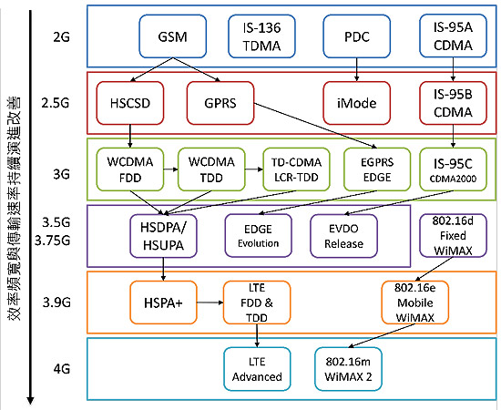
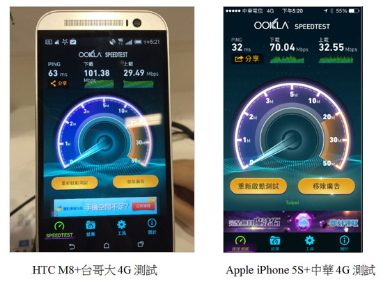

#行動通訊世代初探 - 行動通訊一點點

2014-07

從2007年的第一代iPhone開始，智慧型手機的崛起大大改變了行動網路的生態，十多年前我們很難想像會用「手機」上網，除了只有小小黑黑醜醜的畫面以外，烏龜般的速度及昂貴的資料傳輸費率，讓人們對手機上網這件事情敬而遠之，僅有少數一秒鐘幾十萬上下的貴客會需要在移動中使用資料傳輸，進行收發電子郵件等商務用途。

現在，沒有用智慧型手機、手機沒有申辦行動上網業務的人，反而成了這時代裡特別的一群。短短不到十年的光景，行動通訊的演進超乎人們想像，現在電信三雄加上自稱第四大電信的威寶（威寶已被台灣之星收購，成為台灣之星百分百持股公司）已經在台灣正式啟動4G業務。回顧行動上網開始流行，是在3G的時代，到底3G、4G跟我們聽到的8G、16G、32G有什麼不一樣呢？請接著看以下介紹，讓您一看就懂：

##什麼是G - “G”eneration

如聽過X世代，Y世代，絕對可以輕鬆寫意地明白「Generation」所代表的意義，在行動通訊領域則代表不同世代(Generation)的行動通訊技術演化，而每個不同世代的通訊技術，都還有其主流、小改版和延伸。第一代行動通訊(1st Generation)標準稱為「進階行動通訊系統(Advanced Mobile Phone System, AMPS)」，1G的行動通訊屬於類比式系統，只是單純提供電信話務，沒有提供數位資料、數據傳輸的功能，也就是手機俗稱「黑金剛」的時代。第二代行動通訊則是捨棄類比系統，轉進數位系統的時代，稱為「全球行動通訊系統(Global System for Mobile Communications, GSM)」，隨後行動通訊開始提供數位資料傳輸，剛好伴隨著全球資訊網(World Wide Web, WWW)以及網際網路興起，人們對於行動通訊、無線數據資料傳輸功能的需求慢慢提升，而整體行動通訊有著爆炸式的影響，則是在智慧型手機興起之後，行動裝置的應用與趨勢遂成為擋不住的浪潮，對於行動通訊速度與品質的要求與需求，也隨之越來越高，因此3G、3.5G、4G標準與技術規格一直持續制訂演進，成為現今我們看到已經在商業運轉的行動通訊技術，至於第五代行動通訊(5G)的技術標準與研究，也持續在制訂進行中。

 

行動通訊標準演進示意
從圖1為行動通訊標準演進的示意圖，整體行動通訊標準主要由3rd Generation Partnership Project(3GPP)所制定，不同世代的行動通訊技術標準相當繁多，如對標準有興趣，可以在3GPP網站取得，表1整理不同世代主流標準，透過表1可以快速瞭解市場上耳熟能詳的主流行動通訊技術：

表1.行動通訊演進簡表

|世代|主流技術|摘要介紹
|--|--|--|
|1G|AMPS|類比式行動電話系統，屬於第一代行動電話系統。約1980年在美國發展，為蜂巢式系統(Cellular)，將所涵蓋的區域劃分為細胞群，使用800MHz頻段。類比訊號電波容易被干擾及竊聽，因此，2000年後逐漸被第二代全球行動通訊系統(GSM)取代。|
|2G|GSM|全球行動通訊系統(Global System for Mobile Communications, GSM)為目前應用最為廣泛的行動電話標準，多個國家電信營運商已有漫遊協議，可提供跨國的電信漫遊服務。|
|2.5G|GPRS、EDGE|泛用封包無線服務(General Packet Radio Service, GPRS)是最早期且最速率最低的行動上網技術。目前各大運營商(除CDMA系運營商外)都支援此業務，通常在訊號品質不夠好的時候，行動裝置會切換到此種服務，偶而看到手機的資料傳輸顯示G或者E的時候，就是這個情況，GPRS一般傳輸速率為不會高於128Kbps。|
|3G|UMTS、WCDMA、CDMA2000|通用行動通訊系統(Universal Mobile Telecommunications System, UMTS)，主要由歐洲3GPP組織推出的標準，美國則是CDMA技術為主。3G由2.5G GSM的GPRS和EDGE演進而來。WCDMA，包括HSPA皆為UMTS子集合，台灣代表營運商是中華電信、遠傳電信、台灣大哥大與威寶電信。CDMA2000則是美系3G標準，台灣代表營運商是亞太電信|
|3.5G|HSPA|高速資料連結(High Speed Packet Access, HSPA)，提供比3G更快的資料傳輸協定，理論速度最高達7.2Mbps，HSPA主要分為HSDPA(高速下載資料連結)和HSUPA(高速上傳資料連結)，其中HSUPA又被稱做3.75G，因提供了更佳的上傳速率。|
|3.9G|LTE|長期演進技術(Long Term Evolution, LTE)，被視為邁向4G網路的標準，希望藉由與現有3G系統相容並且進行長期演進，在行動或者靜止的狀態下，都要能夠提供比目前3G、3.5G來得更高的傳輸速率。|
|4G|LTE Advanced|LTE-Advanced是3GPP標準組織發展的LTE演進版本，目標要達到或超越國際電信聯盟(ITU Telecommunication Standardization Sector , ITU-T)制訂的IMT-Advanced規範，完成一套真正屬於4G的通訊標準。|

##4G技術標準簡述

早期學界和業界觀點，對市場普遍認知4G要達到的目標為：在「低速的移動下提供1 Gbit/s」傳輸速率，而在「高速移動下亦能提供上至約100 Mbit/s」的傳輸速率之能力[2]。當3G標準制定完畢與開始商業運轉時，3GPP聯盟已開始著手規劃4G標準，在電信開發商與營運商遵循標準的3GPP Release 8第一次提出LTE (Long Term Evolution)相關標準，代表LTE即為Release-8主要技術重點，整體R8是從更早之前的 UMTS/WCDMA (3GPP Release 99)、 HSDPA (Release 5)、HSUPA (Release 6)、HSPA+ (Release 7)持續演進而來，LTE系統核心技術規範已於R9定案。

目前台灣市場各電信業者喊得震天響的「4G」核心技術是LTE，從標準的觀點來看算不算真正的4G，最多是3.9G－也就是3G過渡到4G之間的一個長期演進，真正4G標準是LTE Advanced (LTE-A)技術。只是商場上普遍把LTE講成4G，如此，對消費者來說比較有「我們的電信業者又往前邁進一個世代」的感覺，所以業者們約定成俗的把LTE當成4G，反正他們認為消費者不懂，不過聯合報系同仁們可以知道一下，當個聰明的消費者。

##台灣4G現況

各大電信業者均有數百萬計的使用者，如需更新基地台到第四代行動通訊基礎建設，除了要付出相當大的投資成本外，如何維持現有用戶正常服務，遂成為相當重要的課題，如同報系系統需要更新、改善，在事前作業都需要詳細良好的溝通、測試與規劃，因此，早在2010年中華電信與交通大學合作LTE道路移動測試，使用在2.3GHz的頻段，頻寬為20MHz，測試結果下傳速率約80Mbps，上傳速率約15.3Mbps，傳輸延遲為24~35毫秒[2]。

升級到第四代行動通訊，對台灣的電信業者來說，是一條漫長但是要趕快走的路，包含使用執照的取得、可用頻段的淨空、電信設備升級一直到用戶行動裝置支援等環節一關接一關。在執照取得和設備升級的部分，電信業者算有初步成果並且大量開台，使用者裝置支援程度又還是一個正在成長的階段。

##4G執照的取得

如同報系要推動udn tv要上到電視頻道一般，需要經過層層審核與把關，無線使用的頻道也必須經過類似的程序，最高管理單位國家通訊委員會2013年六月受理4G LTE使用頻段的競標，國內預定安排釋出的行動寬頻通訊頻段，包括700MHz、900MHz與1800MHz三個頻段，釋出總頻寬共計270MHz，劃分為27個單位提供業者競標，2013年底時已確定各頻段得標廠商並且發出使用執照[3]，在台灣看似營運商對4G LTE競賽的開始，但在國際上則是對於商業化營運落後的努力追趕。

不同手機、不同業者、同時同地的4G傳輸表現，左為HTC ONE M搭配台灣大哥大，右為Apple iPhone 5S搭配中華電信，地點皆於台北市信義區華納威秀台灣大哥大服務中心內，信義威秀附近是4G競賽重鎮，電信三雄在此都有服務中心，這個區域的4G傳輸表現都不會太差，在品質良好、沒有太多人搶頻寬的狀況下，速度已經可以比擬家裡申裝的光世代100M/40M，如果能住在這裡就不用申請光世代了。(備註：因沒玩線上遊戲，所以對網路延遲ping值要求不太高。)

##行動通訊提升後，發展方向

報系數位匯流的方向正確且不變，相信管理階層期許每位同仁都努力讓報系所提供的服務能夠在各式各樣的載具上呈現與運作，在發展的同時，也要適當注意使用者實際使用的體驗與感受，例如：聯合新聞網的影音新聞、udn tv，在現有3G主流環境下，是否能夠順暢地為使用者帶來良好的體驗？而到4G高速行動通訊環境穩定順暢的時候，又能夠為使用者帶來如何的品質或者有更多的服務與體驗？這些都需要事先評估測試，並且提早佈局，除服務多元呈現外，最重要的是使用者經驗的改善以及創新商業模式的建立，如此，持續讓聯合報集團身這隻領頭羊持續邁進向前。

##參考資料

* 財團法人工業技術研究院-經濟部標準檢驗局 
* 101年度委辦計畫-第四代行動通訊重點技術與先期標準分析研究報告
* DIGITIMES中文網 - 台灣LTE發展概況
* NCC開始受理業者申請競標4G LTE頻段，蘇文彬，2013/05/05